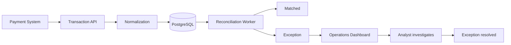
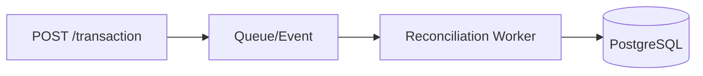
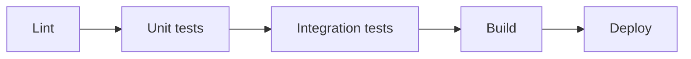

# Discovery

## 1. Business Problem

Businesses that process payments often have transaction data coming from multiple systems:
* Payment gateways
* Banks/payment processors
* Internal order or billing systems
* Refund systems
* Settlement reports

These systems don't always represent transactions in exactly the same way or at the same time. A payment may appear as successful in one system but be missing from another, have a different reference ID, settle for a different amount, or be refunded later.

This creates a reconciliation problem.
A finance or operations employee may have to manually compare large numbers of transactions across systems to determine:
* Which transactions match
* Which transactions are missing
* Which amounts don't agree
* Which transactions were refunded
* Which payments are still unresolved
* Whether the processor's settlement amount agrees with the expected amount

### Proposed solution
Build a **Financial Operations & Payment Reconciliation Platform** that ingests payment/transaction data from multiple sources, normalizes it, automatically matches related transactions, identifies discrepancies, and provides an operational dashboard for investigating and resolving them.
  
The portfolio project should simulate the kinds of systems a real financial-operations team might use without handling real customer financial data.

## 2. Users
### Primary user: Operations/Finance Analyst

Responsible for monitoring transactions and resolving reconciliation issues.
They need to:
* View transactions
* See reconciliation status
* Investigate discrepancies
* Compare records from different systems
* Resolve exceptions
* Track unresolved issues

### Secondary user: Operations Manager
Needs higher-level visibility into system health and reconciliation performance.
They need to:
* View reconciliation metrics
* Monitor unresolved exceptions
* Identify recurring problems
* Review analyst activity
* Export reports

### System/API users
Other internal services interact with the platform through APIs.
For example:
* Payment service
* Order service
* Settlement processor
* Reporting service
This is important because it lets your project demonstrate **API design and service-to-service communication**, rather than being merely a dashboard application.

### 3. Scope
#### In scope
The first version should include:
1. Transaction ingestion
2. Data normalization
3. Transaction storage
4. Automatic reconciliation
5. Matching logic
6. Exception/discrepancy detection
7. Exception investigation
8. Exception resolution
9. Search/filtering
10. Operational dashboard
11. REST API
12. Authentication/authorization
13. Audit logging
14. Background processing
15. Automated testing
16. Monitoring/observability
17. Deployment through CI/CD

### Example workflow



### 4. Functional Requirements
#### FR-01 — User authentication
The system shall allow authorized users to authenticate.
Users shall have roles such as:
* Analyst
* Manager
* Administrator
The system shall restrict functionality according to the user's role.

#### FR-02 — Transaction ingestion
The system shall accept transaction records through an API.
A transaction should contain information such as:
* Transaction ID
* External reference
* Source system
* Amount
* Currency
* Transaction type
* Transaction status
* Timestamp
* Customer/order reference
* Processor reference
The system should also support importing transaction data in a controlled batch format.

#### FR-03 — Transaction normalization
The system shall convert transactions from different source formats into a common internal representation.
For example:

```
Gateway A:
payment_id
amount
status

Processor B:
reference_number
gross_amount
transaction_state
```

Both should become a standardized internal transaction model.

#### FR-04 — Duplicate detection
The system shall detect potentially duplicated transactions.
It should identify duplicates based on appropriate combinations of fields such as:
* External reference
* Processor transaction ID
* Timestamp
* Amount
* Source
Duplicates should be flagged rather than silently discarded.

#### FR-05 — Automatic reconciliation
The system shall compare transactions from different sources and determine whether they correspond to one another.
Possible reconciliation outcomes:

| **Status** | **Meaning** |
| --- | --- |
| Matched | Records correspond and amounts agree |
| Amount mismatch | Records correspond but amounts differ |
| Missing | Expected record doesn't exist in another source |
| Duplicate | Multiple records appear to represent the same transaction |
| Status mismatch | Transaction states disagree |
| Pending | Insufficient information to reconcile |
| Resolved | Previously identified exception has been resolved |

#### FR-06 — Matching rules
The reconciliation engine shall use configurable matching rules.
For example:
```
Processor reference matches
        AND
transaction currency matches
        AND
amount matches
```
A later iteration could support confidence scores for less certain matches.

### FR-07 — Exception management
The system shall create an exception whenever reconciliation identifies a discrepancy.
Each exception should include:
* Exception ID
* Transaction(s) involved
* Exception type
* Severity
* Description
* Created timestamp
* Current status
* Assigned analyst
* Resolution information

### FR-08 — Exception investigation
An analyst shall be able to open an exception and inspect the underlying records.
The UI should make differences between records easy to understand.
For example:
```
Internal       Processor
Amount           $125.00        $120.00
Status           CAPTURED       SETTLED
Reference        ABC123         ABC123
```

### FR-09 — Exception resolution

An authorized user shall be able to:
* Assign an exception
* Change its status
* Add notes
* Record a resolution
* Mark it resolved
The system shall preserve the history of these changes.

### FR-10 — Search and filtering
Users shall be able to search transactions and exceptions.
Filtering should include:
* Date
* Status
* Source
* Amount
* Currency
* Exception type
* Severity
* Assigned user

### FR-11 — Dashboard
The system shall provide operational metrics such as:
* Total transactions
* Successfully reconciled transactions
* Unmatched transactions
* Amount mismatches
* Duplicate transactions
* Open exceptions
* Resolved exceptions
* Reconciliation rate
The platform will provide measurable operational metrics that can be used to evaluate workflow efficiency, system performance, and user outcomes.

### FR-12 — API
The platform shall expose documented APIs for:
* Transaction ingestion
* Transaction retrieval
* Reconciliation results
* Exception management
* Reporting
The API should have clear contracts and validation.

### FR-13 — Background processing
Reconciliation should not require the user to wait for every transaction to be processed synchronously.

The system shall support asynchronous/background processing.
For example:

This is particularly valuable for demonstrating backend/distributed-systems skills.

### FR-14 — Audit trail
The system shall record significant actions, including:
* Exception creation
* Assignment
* Status changes
* Resolution
* Administrative changes
The audit trail should identify who performed the action and when.

### FR-15 — Reporting/export
Authorized users shall be able to generate reconciliation reports.
For example:
```
Date: August 19, 2026

Transactions:        10,000
Matched:              9,720
Exceptions:             280
Reconciliation rate:  97.2%
```

### 5. Non-Functional Requirements
These are particularly important because they distinguish this project from a typical portfolio CRUD application.

#### NFR-01 — Performance
Common API requests should respond quickly under normal operating conditions.
The system should establish measurable targets rather than simply claiming that it is "fast."
For example:
* p95 API latency < 500 ms for ordinary read operations
* Background reconciliation processing measured in transactions/second
The exact targets can be established during the engineering phase.

#### NFR-02 — Scalability
The architecture should support increasing transaction volumes without requiring fundamental redesign.
The reconciliation workload should be capable of being distributed across multiple workers.

#### NFR-03 — Reliability
The system should tolerate individual background-processing failures without losing transactions.
Failed jobs should be retryable.

#### NFR-04 — Idempotency
Submitting the same transaction multiple times should not create unintended duplicate records.
This is especially important for payment-related systems.

#### NFR-05 — Security
The system shall protect sensitive financial information.
Requirements should include:
* Authentication
* Authorization
* Input validation
* Secure API access
* Encryption in transit
* Secure credential management
* Audit logging
* No sensitive secrets committed to source control
The portfolio implementation should use **synthetic data only**.

#### NFR-06 — Observability
The application should provide sufficient observability to diagnose failures and identify their root causes. For example, when reconciliation fails for a transaction, the available logs, metrics, traces, and error information should allow engineers to determine why the reconciliation failed.

#### NFR-07 — Maintainability
The codebase should have:
* Clear separation of concerns
* Automated tests
* Consistent coding standards
* Documentation
* Clear API contracts
* Reusable components

#### NFR-08 — Testability
Critical functionality shall have automated tests.
At minimum:
* Unit tests
* API/integration tests
* Reconciliation-engine tests
* Database tests
* End-to-end tests for important workflows

#### NFR-09 — Deployment
The application should be deployable through an automated CI/CD pipeline.
A successful deployment should run appropriate:


#### NFR-10 — Availability
The system should include health checks and mechanisms for identifying service degradation.
For example:
```
GET /health
GET /ready
```

### 6. Constraints
The system will be developed as a standalone demonstration platform using synthetic data and will not process real financial transactions.

#### Technical constraints
* Use synthetic financial and payment data only.
* Do not connect to real payment accounts or financial institutions.
* Do not store real card numbers, bank credentials, or other sensitive financial information.
* The system must be implementable and maintainable by a small development team.
* Cloud infrastructure and third-party services should remain within a low-cost development budget.
* The architecture should demonstrate appropriate production engineering practices while avoiding unnecessary complexity for the project's intended scale.

#### Project constraints
The project will have a clearly defined Minimum Viable Product (MVP) focused on the core business problem.
* The MVP will focus on the highest-value workflows identified during discovery.
* Features that are not required to address the core problem will be deferred.
* The system will be designed to demonstrate an appropriate level of architectural, testing, deployment, and operational maturity without introducing unnecessary complexity.
* The implementation, testing, deployment, and operational requirements must remain feasible within the project's available resources and scope.

#### Scope constraint
The system will simulate payment and settlement sources rather than integrating with real banking or payment infrastructure.

All payment, settlement, and transaction data used by the system will be synthetic. The system will not process real financial transactions or require access to real banking or payment accounts.

### 7. Success Criteria
The system will use measurable success criteria to evaluate whether the solution addresses the identified business problem.

#### Business success
* Operations analysts can identify reconciliation discrepancies without manually comparing transaction records across multiple sources.
* The system automatically reconciles eligible transactions when sufficient matching information is available.
* The system provides sufficient information for analysts to investigate and resolve transactions that cannot be automatically reconciled.
* Reconciliation outcomes can be measured using system-generated metrics.

#### Technical success
The project should demonstrate:
| **Area** | **Success criterion** |
| --- | --- |
| Backend | Production-quality API and business logic |
| Database | Proper relational data model and optimized queries |
| Reconciliation | Reliable automated matching engine |
| Async processing | Background workers/queue processing |
| APIs | Documented REST API |
| Security | Authentication, authorization and secure data handling |
| Testing | Strong automated test coverage of critical paths |
| CI/CD | Automated test/build/deployment pipeline |
| Observability | Retry and failure-handling mechanisms |
| Scalability | Ability to increase worker capacity |
| Frontend | Useful operational dashboard |
| Documentation | Architecture and technical decisions documented |

