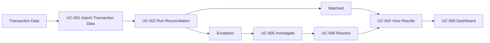

# Use Cases

## 1. Purpose

This document defines the primary use cases for the payment reconciliation system.

The use cases describe how operations users and system components interact with the platform to import transaction data, reconcile transactions, investigate exceptions, resolve discrepancies, and recover from processing failures.

---

## 2. Actors

### Operations Analyst

The primary business user responsible for reviewing reconciliation results, investigating discrepancies, and resolving exceptions.

### Operations Manager

A supervisory user responsible for monitoring reconciliation performance, reviewing unresolved exceptions, and overseeing operational activity.

### System Administrator

A technical user responsible for monitoring system health, investigating processing failures, and reprocessing failed jobs where appropriate.

### Transaction Source

An external or simulated system that provides transaction records to the reconciliation platform.

Examples may include:

- Internal payment systems
- Payment processors
- Settlement systems

### Reconciliation Worker

An automated system component responsible for processing reconciliation jobs and applying transaction-matching rules.

---

# 3. UC-001 — Import Transaction Data

## Goal

Import transaction records from a supported source into the reconciliation platform.

## Primary Actor

Transaction Source

## Supporting Actors

System Administrator

## Preconditions

- The source is supported by the system.
- Transaction data is available in an accepted format.
- The source is authorized to submit data.

## Trigger

A transaction source submits or imports transaction data.

## Main Flow

1. The transaction source submits transaction records.
2. The system receives the data.
3. The system validates the structure and required fields.
4. Valid records are normalized into the system's internal transaction format.
5. The system stores the normalized records.
6. The system records the import result.
7. Eligible transactions become available for reconciliation processing.

## Alternative Flows

### A1 — Invalid Record

1. The system identifies a record that fails validation.
2. The invalid record is not treated as a valid transaction.
3. The system records the validation failure.
4. Valid records in the same import may continue processing where appropriate.

### A2 — Duplicate Submission

1. The system identifies transaction data that has already been submitted.
2. The system prevents unintended duplicate transaction creation.
3. The duplicate submission is recorded or reported.

## Postconditions

- Valid transactions are stored.
- Invalid records are identifiable.
- Duplicate submissions do not create unintended duplicate data.

## Related Requirements

- FR-001
- FR-002
- FR-012
- NFR-005
- NFR-014

---

# 4. UC-002 — Run Reconciliation

## Goal

Automatically compare eligible transaction records and determine their reconciliation outcome.

## Primary Actor

Reconciliation Worker

## Supporting Actors

Operations Analyst

## Preconditions

- Valid transaction records exist.
- Eligible records have not already been successfully reconciled.
- Required system components are available.

## Trigger

A reconciliation job is created for eligible transaction data.

## Main Flow

1. The system creates a reconciliation job.
2. The reconciliation worker retrieves the pending job.
3. The worker marks the job as processing.
4. The worker retrieves the relevant transaction records.
5. The worker applies the configured matching rules.
6. The worker determines the reconciliation outcome.
7. Matching transactions are marked as reconciled.
8. Non-matching transactions are assigned the appropriate exception type.
9. The system stores the reconciliation results.
10. The reconciliation job is marked as completed.
11. Reconciliation metrics are updated.

## Alternative Flows

### A1 — Amount Mismatch

1. Related transactions are identified.
2. The amounts do not match.
3. The system creates an amount-mismatch exception.
4. The records remain unreconciled pending investigation.

### A2 — Missing Corresponding Transaction

1. The system cannot find the expected corresponding record.
2. A missing-transaction exception is created.

### A3 — Duplicate Transaction

1. Multiple records appear to represent the same transaction.
2. The system creates a duplicate-transaction exception.

### A4 — Processing Failure

1. An unexpected error prevents reconciliation from completing.
2. The job is marked as failed.
3. Diagnostic information is recorded.
4. Incomplete processing is not reported as successful.
5. The job may later be retried.

## Postconditions

One of the following is true:

- Transactions are successfully reconciled.
- A reconciliation exception has been created.
- The reconciliation job has failed and is available for investigation.

## Related Requirements

- FR-003
- FR-004
- FR-005
- FR-006
- FR-007
- FR-018
- NFR-004
- NFR-005
- NFR-017
- NFR-018

---

# 5. UC-003 — View Reconciliation Results

## Goal

Allow an operations analyst to review reconciliation outcomes.

## Primary Actor

Operations Analyst

## Preconditions

- The user is authenticated and authorized.
- Reconciliation results exist.

## Trigger

The analyst opens the reconciliation results interface.

## Main Flow

1. The system retrieves reconciliation records.
2. The system displays the records and their statuses.
3. The analyst can distinguish between:
   - Reconciled transactions
   - Exceptions
   - Pending transactions
   - Failed processing jobs
   - Resolved exceptions
4. The analyst selects a record for further inspection if necessary.

## Alternative Flows

### A1 — No Results

1. No reconciliation results match the current criteria.
2. The system displays an appropriate empty state.

### A2 — Data Retrieval Failure

1. The system cannot retrieve reconciliation results.
2. The user receives a clear error message.
3. Diagnostic information is recorded.

## Postconditions

- The analyst can determine the current state of reconciliation activity.

## Related Requirements

- FR-008
- FR-014
- FR-015
- NFR-031
- NFR-032
- NFR-033

---

# 6. UC-004 — Search and Filter Reconciliation Records

## Goal

Find specific transactions or reconciliation records efficiently.

## Primary Actor

Operations Analyst

## Preconditions

- The analyst is authenticated.
- Reconciliation data exists.

## Trigger

The analyst enters search criteria or applies filters.

## Main Flow

1. The analyst enters search criteria or selects filters.
2. The system validates the search request.
3. The system retrieves matching reconciliation records.
4. The matching records are displayed.
5. The analyst may open a record for further investigation.

## Search and Filter Criteria

The system should support relevant criteria such as:

- Transaction identifier
- Reconciliation status
- Exception type
- Transaction date
- Source
- Processing status

## Alternative Flows

### A1 — No Matching Records

1. No records match the supplied criteria.
2. The system displays an appropriate message.

## Postconditions

- Relevant reconciliation records are displayed without requiring manual comparison across source systems.

## Related Requirements

- FR-014
- NFR-001
- NFR-031

---

# 7. UC-005 — Investigate Reconciliation Exception

## Goal

Determine why a transaction could not be automatically reconciled.

## Primary Actor

Operations Analyst

## Preconditions

- The analyst is authenticated and authorized.
- A reconciliation exception exists.

## Trigger

The analyst opens a reconciliation exception.

## Main Flow

1. The system retrieves the exception.
2. The system retrieves the associated transaction records.
3. The system displays the relevant values from each source.
4. The system displays the exception type.
5. The system displays the reason automatic reconciliation failed.
6. The analyst compares the relevant transaction details.
7. The analyst reviews available reconciliation history and audit information.
8. The analyst determines the appropriate next action.

## Example

The analyst may see:

| Attribute | Internal Record | Settlement Record |
|---|---:|---:|
| Reference | TXN-10242 | TXN-10242 |
| Amount | 125.00 | 120.00 |
| Currency | USD | USD |
| Status | Captured | Settled |

The exception is identified as an amount mismatch.

## Alternative Flows

### A1 — Required Source Data Missing

1. One of the expected source records is unavailable.
2. The system identifies the missing information.
3. The analyst may defer resolution until additional information becomes available.

### A2 — Diagnostic Information Unavailable

1. Required diagnostic information cannot be retrieved.
2. The system reports the limitation.
3. The failure is recorded for technical investigation.

## Postconditions

- The analyst understands the available reason for the reconciliation exception.
- The exception remains unresolved until an appropriate resolution is recorded.

## Related Requirements

- FR-007
- FR-009
- FR-013
- NFR-017
- NFR-020
- NFR-022
- NFR-031

---

# 8. UC-006 — Resolve Reconciliation Exception

## Goal

Record the resolution of an investigated reconciliation exception.

## Primary Actor

Operations Analyst

## Supporting Actors

Operations Manager

## Preconditions

- The analyst is authenticated and authorized.
- The exception exists.
- The exception is not already resolved.

## Trigger

The analyst selects an action to resolve the exception.

## Main Flow

1. The analyst opens the exception.
2. The analyst reviews the reconciliation information.
3. The analyst selects a resolution status.
4. The analyst enters a resolution reason.
5. The analyst optionally adds notes.
6. The system validates the resolution.
7. The system records:
   - Resolution status
   - Resolution reason
   - Resolving user
   - Resolution timestamp
   - Notes
8. The exception is marked as resolved.
9. The resolution is added to the audit history.

## Alternative Flows

### A1 — Missing Required Resolution Information

1. The analyst attempts to resolve the exception without required information.
2. The system rejects the request.
3. The system identifies the missing information.
4. The analyst corrects the request.

### A2 — Unauthorized User

1. A user without sufficient permissions attempts to resolve the exception.
2. The system rejects the action.
3. The unauthorized attempt may be recorded where appropriate.

## Postconditions

- The exception is resolved.
- The resolution is preserved in the reconciliation history.
- The action is auditable.

## Related Requirements

- FR-010
- FR-013
- FR-017
- NFR-015
- NFR-025

---

# 9. UC-007 — Retry Failed Reconciliation Job

## Goal

Reprocess a reconciliation job that previously failed because of a recoverable system or processing error.

## Primary Actor

System Administrator

## Supporting Actors

Reconciliation Worker

## Preconditions

- A reconciliation job exists in a failed state.
- The user is authorized to retry failed jobs.
- The underlying cause of failure is believed to be recoverable or resolved.

## Trigger

The administrator requests that the failed job be retried.

## Main Flow

1. The administrator opens the failed job.
2. The system displays the failure information.
3. The administrator requests a retry.
4. The system validates that the job can be retried.
5. The job is returned to a processable state.
6. A reconciliation worker retrieves the job.
7. The worker processes the reconciliation again.
8. The resulting state is stored.
9. The retry attempt is added to the audit history.

## Alternative Flows

### A1 — Job Cannot Be Retried

1. The system determines that the job is not eligible for retry.
2. The retry request is rejected.
3. The reason is displayed.

### A2 — Retry Fails

1. The reconciliation job fails again.
2. The system records the new failure.
3. The job remains available for further investigation.

### A3 — Previously Persisted Data Exists

1. The retry encounters data created during an earlier processing attempt.
2. Idempotency controls prevent duplicate logical results.
3. Processing continues safely or terminates according to the reconciliation rules.

## Postconditions

- The job is either successfully reprocessed or remains in a failed state with updated diagnostic information.
- Duplicate logical reconciliation results are not created.

## Related Requirements

- FR-011
- FR-012
- FR-018
- NFR-004
- NFR-005
- NFR-006

---

# 10. UC-008 — Monitor Reconciliation Operations

## Goal

Monitor reconciliation processing and identify operational problems.

## Primary Actor

System Administrator

## Supporting Actors

Operations Manager

## Preconditions

- The user is authenticated and authorized.
- Operational information is available.

## Trigger

The user opens the monitoring or operational status interface.

## Main Flow

1. The system provides current processing information.
2. The user reviews relevant metrics such as:
   - Pending jobs
   - Completed jobs
   - Failed jobs
   - Transactions processed
   - Processing duration
   - API error rate
3. The system provides health information for critical components.
4. The user identifies unusual or degraded behavior where present.
5. The user may investigate individual failures or affected jobs.

## Alternative Flows

### A1 — Component Unhealthy

1. A critical component reports an unhealthy state.
2. The system exposes the degraded condition.
3. Diagnostic information is available for investigation.

## Postconditions

- The user can determine whether reconciliation processing is operating normally.
- Operational failures can be identified for investigation.

## Related Requirements

- FR-016
- FR-019
- NFR-017
- NFR-018
- NFR-019
- NFR-021

---

# 11. UC-009 — Review Reconciliation Dashboard

## Goal

Provide an operations user with an overview of reconciliation performance.

## Primary Actor

Operations Manager

## Supporting Actors

Operations Analyst

## Preconditions

- The user is authenticated.
- Reconciliation data exists.

## Trigger

The user opens the reconciliation dashboard.

## Main Flow

1. The system retrieves reconciliation summary data.
2. The system displays metrics including:
   - Total transactions processed
   - Automatically reconciled transactions
   - Reconciliation exceptions
   - Failed jobs
   - Resolved exceptions
   - Reconciliation rate
3. The user reviews the current operational state.
4. The user may select a metric or category to inspect the underlying records.

## Alternative Flows

### A1 — Insufficient Data

1. Insufficient reconciliation data exists to calculate a metric.
2. The system clearly identifies that the metric is unavailable or incomplete.

## Postconditions

- The user has a measurable overview of reconciliation performance.

## Related Requirements

- FR-015
- NFR-018
- NFR-031
- NFR-032

---

# 12. UC-010 — Review Audit History

## Goal

Review significant actions performed against reconciliation records and exceptions.

## Primary Actor

Operations Manager

## Supporting Actors

Operations Analyst
System Administrator

## Preconditions

- The user is authenticated and authorized.
- Audit records exist.

## Trigger

The user requests the audit history for a relevant entity.

## Main Flow

1. The system retrieves audit records.
2. The system displays relevant events in chronological order.
3. Each event identifies, where applicable:
   - Event type
   - Timestamp
   - Actor
   - Previous state
   - New state
   - Related entity
4. The user reviews the sequence of events.

## Alternative Flows

### A1 — No Audit Records

1. No audit events exist for the selected entity.
2. The system displays an appropriate empty state.

## Postconditions

- The user can determine how the entity changed over time and who performed significant manual actions.

## Related Requirements

- FR-013
- FR-017
- NFR-025

---

# 13. Use Case Summary

| ID | Use Case | Primary Actor | Priority |
|---|---|---|---|
| UC-001 | Import Transaction Data | Transaction Source | Must Have |
| UC-002 | Run Reconciliation | Reconciliation Worker | Must Have |
| UC-003 | View Reconciliation Results | Operations Analyst | Must Have |
| UC-004 | Search and Filter Reconciliation Records | Operations Analyst | Should Have |
| UC-005 | Investigate Reconciliation Exception | Operations Analyst | Must Have |
| UC-006 | Resolve Reconciliation Exception | Operations Analyst | Must Have |
| UC-007 | Retry Failed Reconciliation Job | System Administrator | Should Have |
| UC-008 | Monitor Reconciliation Operations | System Administrator | Should Have |
| UC-009 | Review Reconciliation Dashboard | Operations Manager | Should Have |
| UC-010 | Review Audit History | Operations Manager | Should Have |

---

# 14. Core MVP Use Case Flow

The initial MVP should support the following complete workflow:

