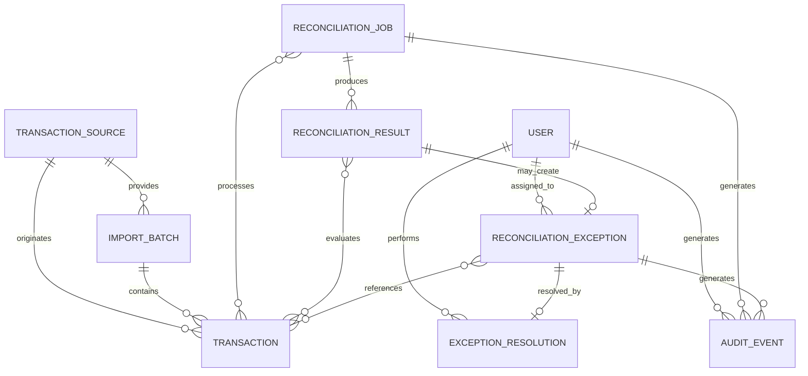

# Domain Model

## 1. Purpose

This document defines the core domain concepts for the payment reconciliation system.

The domain model describes the primary business entities, their responsibilities, important attributes, and relationships. It is independent of the final database schema or application framework.

The purpose of this model is to establish a shared understanding of the problem domain before system and data design decisions are made.

---

## 2. Domain Overview

The reconciliation system receives transaction records from multiple sources, normalizes those records, groups eligible records into reconciliation work, applies matching rules, records reconciliation outcomes, and creates exceptions when automatic reconciliation is not possible.

The core domain concepts are:

- User
- Transaction Source
- Import Batch
- Transaction
- Reconciliation Job
- Reconciliation Result
- Reconciliation Exception
- Exception Resolution
- Audit Event

---

# 3. User

## Purpose

Represents an authenticated person who interacts with the reconciliation system.

## Responsibilities

A user may:

- Review reconciliation results.
- Investigate reconciliation exceptions.
- Resolve exceptions.
- Retry failed reconciliation jobs, where authorized.
- Review operational or audit information.

## Key Attributes

- User ID
- Name
- Email
- Role
- Account status

## Roles

Initial roles include:

- Operations Analyst
- Operations Manager
- System Administrator

## Relationships

- A User may resolve multiple Reconciliation Exceptions.
- A User may trigger retries of Reconciliation Jobs.
- A User may be associated with multiple Audit Events.

---

# 4. Transaction Source

## Purpose

Represents a system from which transaction or settlement data originates.

Examples include:

- Internal payment system
- Payment processor
- Settlement system

For this project, all sources are simulated.

## Key Attributes

- Source ID
- Name
- Source type
- Status

## Responsibilities

A Transaction Source provides records that can be imported, normalized, and compared during reconciliation.

## Relationships

- A Transaction Source may produce multiple Import Batches.
- A Transaction Source may be associated with multiple Transactions.

---

# 5. Import Batch

## Purpose

Represents a collection of transaction records received together from a Transaction Source.

An Import Batch provides a boundary for tracking the outcome of an ingestion operation.

## Key Attributes

- Import Batch ID
- Source
- Imported timestamp
- Processing status
- Total record count
- Valid record count
- Invalid record count

## Possible Statuses

- Received
- Validating
- Completed
- Partially Completed
- Failed

## Relationships

- An Import Batch belongs to one Transaction Source.
- An Import Batch may contain multiple Transactions.
- An Import Batch may contain validation failures.

---

# 6. Transaction

## Purpose

Represents a normalized financial transaction or settlement record imported into the reconciliation system.

A Transaction is the primary financial record used during reconciliation.

## Key Attributes

- Transaction ID
- Source
- External transaction identifier
- Reference identifier
- Amount
- Currency
- Transaction type
- Transaction status
- Transaction timestamp
- Imported timestamp

## Example Transaction Types

- Payment
- Settlement
- Refund

The initial MVP may support only the transaction types required by the core reconciliation workflow.

## Relationships

- A Transaction originates from one Transaction Source.
- A Transaction may belong to one Import Batch.
- A Transaction may participate in one or more reconciliation attempts.
- A Transaction may be associated with a Reconciliation Result.
- A Transaction may be associated with a Reconciliation Exception.

---

# 7. Reconciliation Job

## Purpose

Represents a unit of reconciliation work processed by the system.

A Reconciliation Job identifies the work that needs to be performed and tracks its processing lifecycle.

## Key Attributes

- Reconciliation Job ID
- Status
- Created timestamp
- Started timestamp
- Completed timestamp
- Retry count
- Failure information, where applicable

## Possible Statuses

- Pending
- Processing
- Completed
- Failed

## Responsibilities

A Reconciliation Job:

- Identifies eligible records for reconciliation.
- Tracks reconciliation processing.
- Records whether processing completed successfully.
- Supports retry where appropriate.

## Relationships

- A Reconciliation Job processes one or more Transactions.
- A Reconciliation Job may produce multiple Reconciliation Results.
- A Reconciliation Job may generate multiple Reconciliation Exceptions.
- A Reconciliation Job may have multiple Audit Events.

---

# 8. Reconciliation Result

## Purpose

Represents the outcome of an automatic reconciliation attempt.

A result records whether related transaction records could be successfully reconciled and why that outcome was reached.

## Key Attributes

- Reconciliation Result ID
- Reconciliation status
- Matching rule
- Result reason
- Created timestamp

## Possible Outcomes

- Matched
- Unmatched
- Pending
- Exception

The final status model may be refined during business-rule analysis.

## Responsibilities

A Reconciliation Result should identify:

- Which records were compared.
- Whether they matched.
- Which rule produced the outcome.
- When reconciliation occurred.

## Relationships

- A Reconciliation Result belongs to one Reconciliation Job.
- A Reconciliation Result references the Transactions evaluated.
- A Reconciliation Result may produce a Reconciliation Exception.

---

# 9. Reconciliation Exception

## Purpose

Represents a reconciliation condition that requires investigation or manual handling.

An exception is created when the system cannot automatically reconcile eligible records according to the defined business rules.

## Key Attributes

- Exception ID
- Exception type
- Severity
- Status
- Description
- Created timestamp
- Assigned user, where applicable

## Example Exception Types

- Missing Corresponding Transaction
- Amount Mismatch
- Currency Mismatch
- Status Mismatch
- Duplicate Transaction
- Invalid Data
- Settlement Discrepancy

## Possible Statuses

- Open
- Under Investigation
- Resolved

Additional statuses may be introduced if analysis shows they are necessary.

## Relationships

- A Reconciliation Exception is associated with one Reconciliation Result.
- A Reconciliation Exception references one or more Transactions.
- A Reconciliation Exception may be assigned to a User.
- A Reconciliation Exception may have one Exception Resolution.
- A Reconciliation Exception may have multiple Audit Events.

---

# 10. Exception Resolution

## Purpose

Represents the recorded outcome of a manually resolved reconciliation exception.

## Key Attributes

- Resolution ID
- Resolution type
- Resolution reason
- Notes
- Resolved timestamp
- Resolving user

## Responsibilities

An Exception Resolution preserves:

- How an exception was resolved.
- Why the resolution was chosen.
- Who performed the resolution.
- When the resolution occurred.

## Relationships

- An Exception Resolution belongs to one Reconciliation Exception.
- An Exception Resolution is performed by one User.
- Creating a resolution should generate an Audit Event.

---

# 11. Audit Event

## Purpose

Represents a significant action or state change that must remain traceable.

Audit Events provide historical accountability for important reconciliation and administrative activity.

## Key Attributes

- Audit Event ID
- Event type
- Timestamp
- Actor
- Related entity type
- Related entity identifier
- Previous state, where applicable
- New state, where applicable
- Additional context, where applicable

## Example Events

- Reconciliation Job Created
- Reconciliation Job Retried
- Exception Created
- Exception Assigned
- Exception Status Changed
- Exception Resolved

## Relationships

- An Audit Event may reference a User.
- An Audit Event may reference a Reconciliation Job.
- An Audit Event may reference a Reconciliation Exception.
- An Audit Event may reference other auditable domain entities where required.

---

# 12. Domain Relationships

The high-level domain relationships are:

This diagram represents conceptual relationships only. It does not define the final relational database schema.

# 13. Domain Invariants
The following conditions should remain true within the domain:
1. Every Transaction must originate from a known Transaction Source.
2. A completed Reconciliation Job must have a recorded processing outcome.
3. A Reconciliation Result must identify the transaction records evaluated.
4. An exception marked as resolved must have sufficient resolution information.
5. Manual exception resolution must identify the user who performed the action.
6. Retrying reconciliation processing must not create duplicate logical results.
7. Significant manual changes to reconciliation state must remain auditable.
8. Financial values must retain their associated currency.
9. Synthetic records must not contain real financial credentials or customer financial data.

These invariants may be refined during business-rule analysis.

# 14. Items Requiring Further Analysis
The following areas remain intentionally unresolved at this stage:
* Whether one Transaction can participate in multiple reconciliation attempts.
* Whether one Reconciliation Result may contain more than two Transactions.
* Whether partial reconciliation is required.
* Whether refunds require a separate domain entity or can remain a Transaction type.
* Whether exception assignment is required for the MVP.
* Whether exception severity should be calculated automatically.
* Whether matching rules should be configurable by users.
* Whether reconciliation jobs operate on individual records, batches, date ranges, or another unit of work.

These questions should be resolved through the business-rules and workflow analysis before final database and system design.