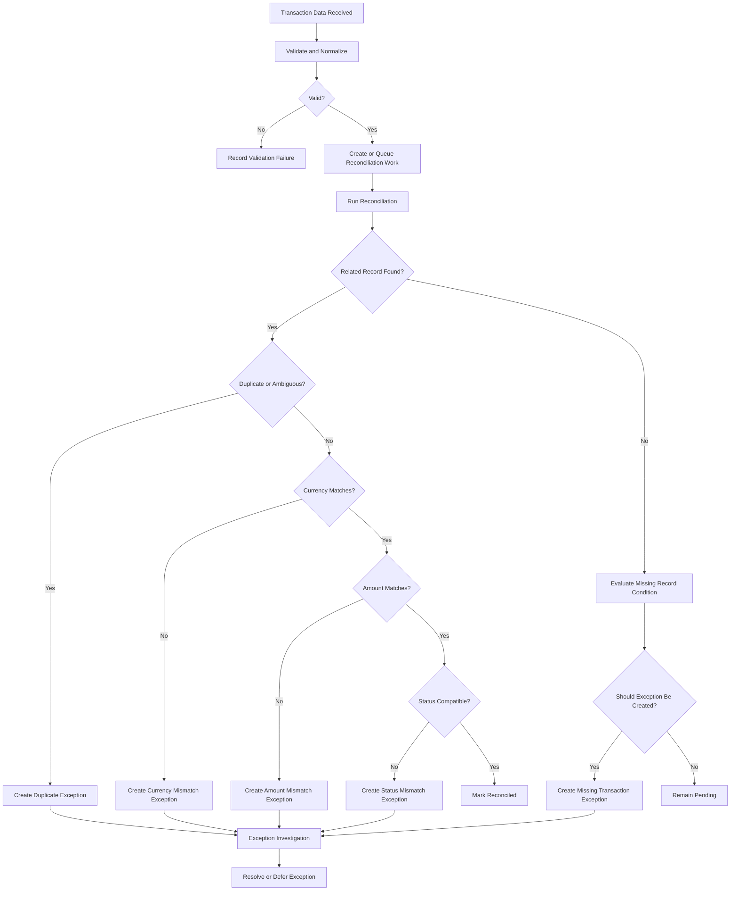

# Workflows

## 1. Purpose

This document defines the primary business workflows for the payment reconciliation system.

The workflows describe how transaction data moves through ingestion, validation, reconciliation, exception handling, resolution, retry, and operational review.

They are intended to clarify process behavior and decision points before implementation and system design.

---

## 2. Workflow Overview

The core reconciliation lifecycle is:

