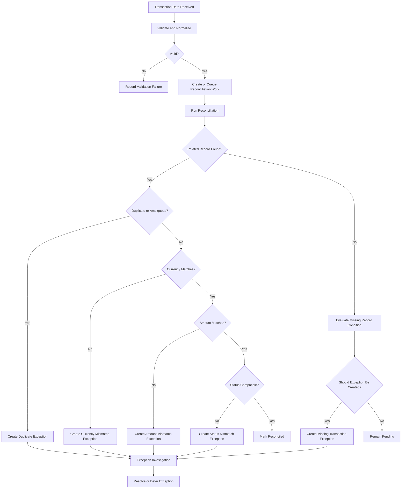
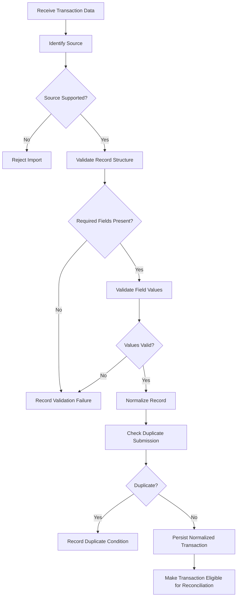
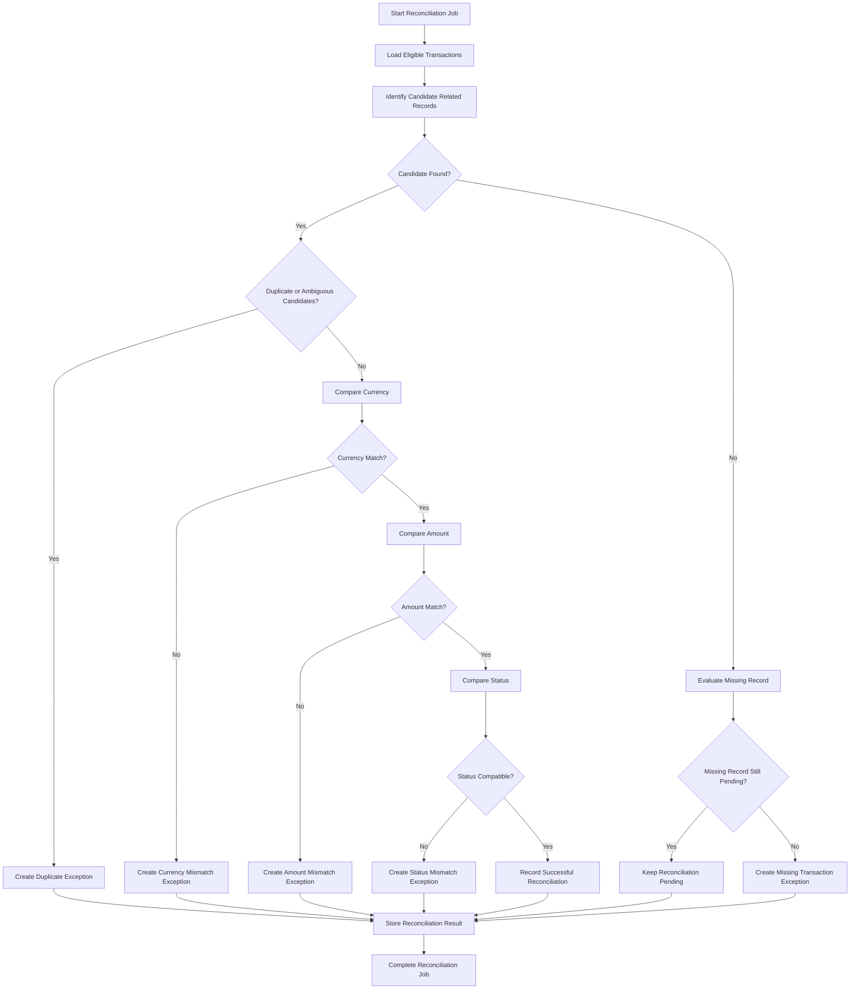
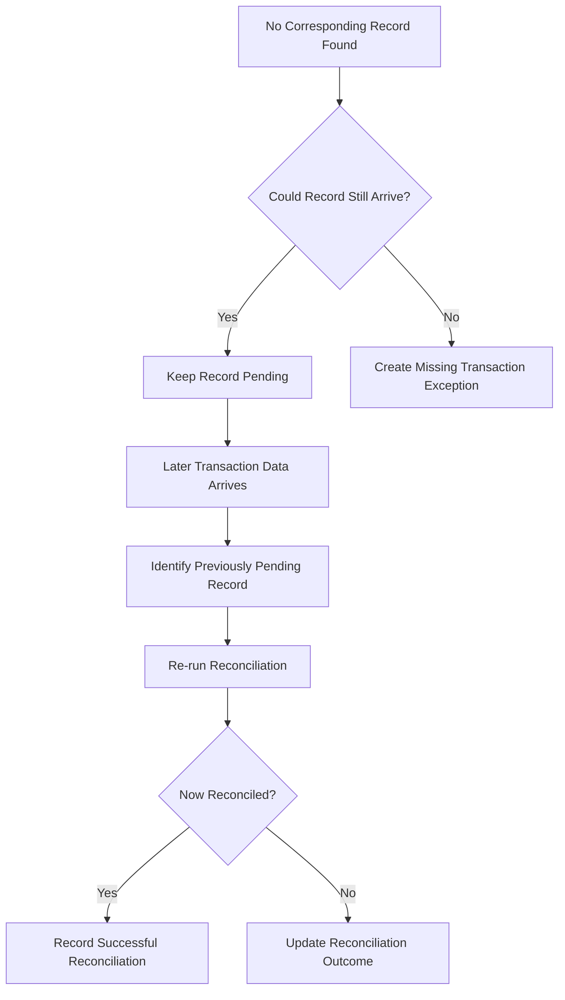
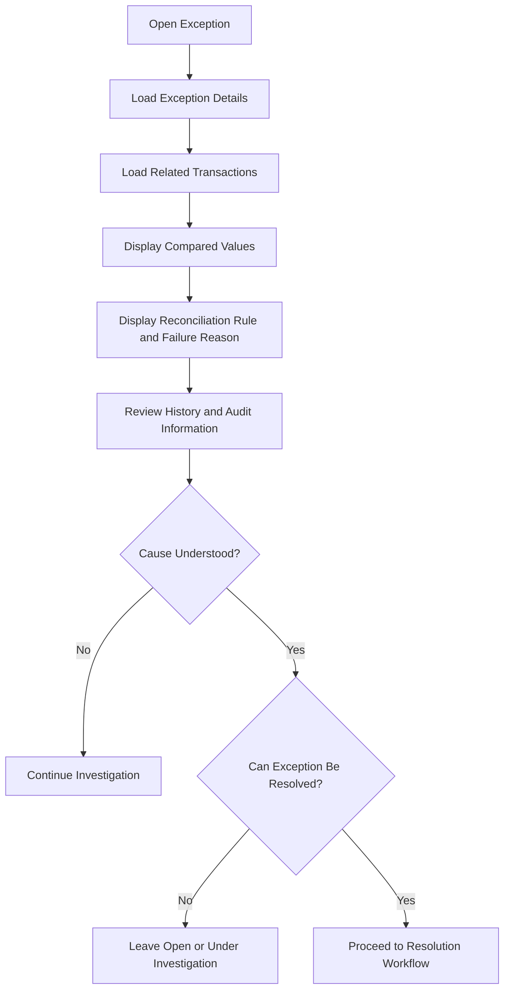
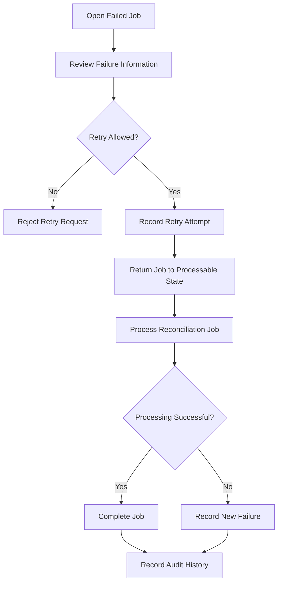
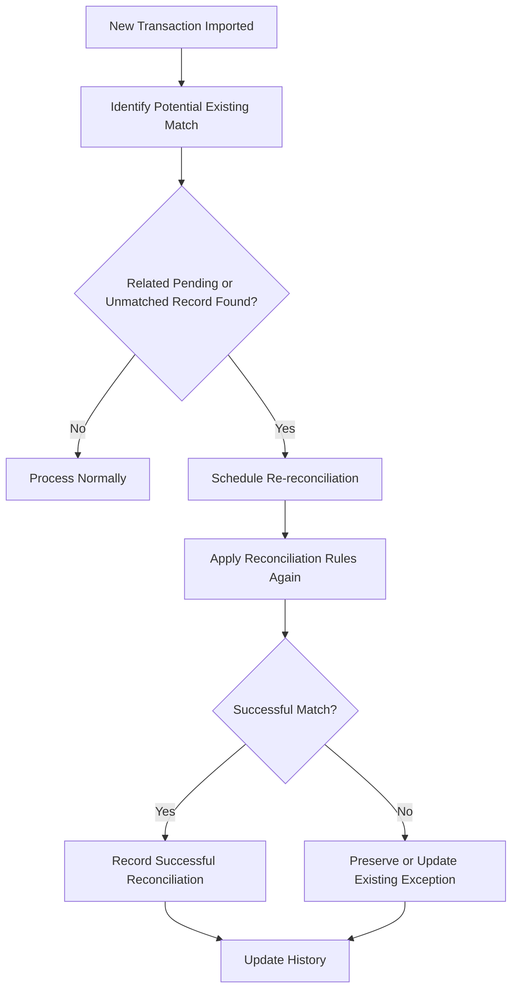
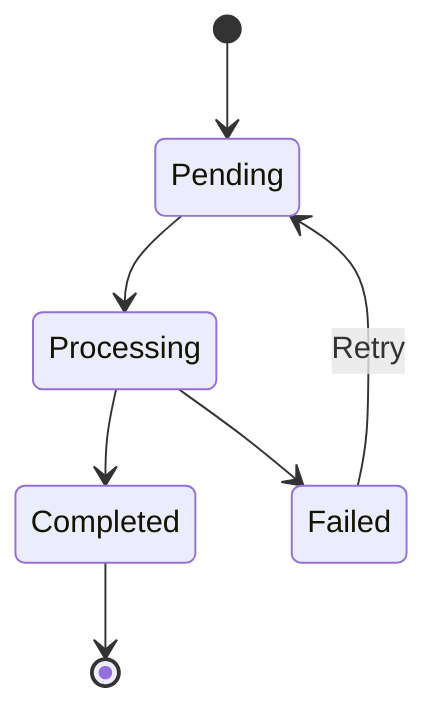

# Workflows

## 1. Purpose

This document defines the primary business workflows for the payment reconciliation system.

The workflows describe how transaction data moves through ingestion, validation, reconciliation, exception handling, resolution, retry, and operational review.

They are intended to clarify process behavior and decision points before implementation and system design.

---

## 2. Workflow Overview

The core reconciliation lifecycle is:



This workflow represents the logical process only. It does not define the final service boundaries, queue technology, database schema, or user interface.

## 3. WF-001 — Transaction Ingestion

### Goal
Receive transaction data from a supported synthetic source and prepare valid records for reconciliation.

### Trigger
Transaction data is submitted by a supported source or controlled batch import.

### Preconditions
* The source is recognized.
* The submitted format is supported.

### Workflow


### Business Rules
* BR-001 — Eligible Records
* BR-018 — Duplicate Submission
* BR-020 — Duplicate Preservation
* BR-043 — Required Transaction Identity
* BR-044 — Source Traceability
* BR-048 — Processing Time

### Outcomes
Successful ingestion results in a normalized transaction eligible for reconciliation.

Failed ingestion results in a recorded validation or duplicate condition that remains available for investigation.

## 4. WF-002 — Automatic Reconciliation
### Goal
Determine whether related transaction records represent a successfully reconciled transaction.

### Trigger
Eligible transactions are available for reconciliation processing.

### Preconditions
* Transaction records are valid and normalized.
* A reconciliation job exists.
* Required records are available for evaluation.

### Workflow


### Business Rules
* BR-002 — Reconciliation Comparison
* BR-003 — Deterministic Results
* BR-005 — Exact Reference Match
* BR-006 — Amount Match
* BR-007 — Currency Match
* BR-008 — Status Compatibility
* BR-009 — Successful Automatic Reconciliation
* BR-017 — One Primary Exception Outcome
* BR-049 — Late-Arriving Records
* BR-050 — Pending Records

### Outcomes
The reconciliation attempt produces one of the following logical outcomes:
* Reconciled
* Pending
* Exception
* Failed processing

## 5. WF-003 — Missing Transaction Handling
### Goal
Handle a transaction for which the expected corresponding record is not currently available.

### Trigger
Automatic reconciliation cannot find an expected related transaction.

### Workflow


## Business Rules
* BR-011 — Missing Corresponding Transaction
* BR-027 — Exception Creation
* BR-049 — Late-Arriving Records
* BR-050 — Pending Records

## Open Decision
The system still requires a defined rule for determining how long a missing record remains pending before becoming an exception.

This decision should be finalized before implementation.

# 6. WF-004 — Reconciliation Exception Investigation
## Goal
Allow an Operations Analyst to determine why automatic reconciliation failed.

## Trigger
The analyst opens an unresolved reconciliation exception.

## Preconditions
The exception exists.
The analyst is authorized to view it.

## Workflow


## Information Required
The investigation view should make it possible to determine:
* Which records were compared.
* Which reconciliation rule was applied.
* Which values matched.
* Which values differed.
* Why the system did not automatically reconcile the records.
* Whether the condition resulted from missing, duplicate, mismatched, or invalid information.

## Business Rules
* BR-027 — Exception Creation
* BR-029 — Investigation Status
* BR-030 — Exception Assignment
* BR-032 — Resolution History
* BR-046 — Reconciliation Traceability

# 7. WF-005 — Exception Resolution
## Goal
Record the outcome of an investigated reconciliation exception.

## Trigger
An authorized Operations Analyst determines that the exception can be resolved.

## Preconditions
* An unresolved exception exists.
* The analyst has sufficient authorization.
* The analyst has reviewed the relevant transaction information.

## Workflow
```mermaid
Workflow
flowchart TD
    A[Select Resolve Exception] --> B[Enter Resolution Information]
    B --> C{Required Information Present?}

    C -- No --> D[Reject Resolution Request]
    D --> B

    C -- Yes --> E[Record Resolution]
    E --> F[Mark Exception Resolved]
    F --> G[Create Audit Event]
    G --> H[Preserve Original Reconciliation Information]
```

### Required Resolution Information
The resolution must include:
* Resolution reason
* Resolving user
* Resolution timestamp

Optional supporting notes may also be recorded.

### Business Rules
* BR-031 — Resolution Requirements
* BR-032 — Resolution History
* BR-033 — Resolved Exception Modification
* BR-034 — Significant Manual Actions
* BR-035 — Audit Attribution
* BR-047 — Resolution Traceability

### Outcome
The exception is marked as resolved while preserving the original exception and reconciliation history.

## 8. WF-006 — Failed Job Retry
### Goal
Safely retry a reconciliation job that failed because of a recoverable processing problem.

### Trigger
An authorized System Administrator requests retry of a failed reconciliation job.

### Preconditions
* The job is in a failed state.
* The failure is considered retryable.
* The user is authorized to retry the job.

### Workflow


### Retry Requirements
A retry must not create duplicate logical:
* Transactions
* Reconciliation results
* Exceptions

Existing successful processing should be preserved where appropriate.

### Business Rules
* BR-022 — Failed Job
* BR-024 — Retry Eligibility
* BR-025 — Retry Idempotency
* BR-026 — Retry History
* BR-038 — Audit Immutability


## 9. WF-007 — Late-Arriving Record Reconciliation
### Goal
Reconsider a previously pending or unmatched transaction when new source data becomes available.

### Trigger
A new transaction record is imported that may correspond to an existing unresolved reconciliation record.

### Workflow


### Business Rules
* BR-003 — Deterministic Results
* BR-032 — Resolution History
* BR-049 — Late-Arriving Records
* BR-050 — Pending Records

### Open Decision
If an exception already exists, analysis must determine whether a late-arriving record:
* Automatically closes the exception,
* Changes it to another state, or
* Requires analyst confirmation.

This should be finalized before implementation.

## 10. WF-008 — Reconciliation Operations Review
### Goal
Allow Operations Managers and System Administrators to identify reconciliation and processing issues.

### Trigger
An authorized user reviews reconciliation operations.

### Workflow
```mermaid
Workflow
flowchart TD
    A[Open Operational View] --> B[Load Reconciliation Metrics]
    B --> C[Load Processing Status]
    C --> D[Load Failure Information]

    D --> E{Problem Detected?}

    E -- No --> F[Continue Monitoring]
    E -- Yes --> G{Business Exception or System Failure?}

    G -- Business Exception --> H[Open Exception Investigation]
    G -- System Failure --> I[Open Failed Job]

    H --> J[Investigate or Resolve]
    I --> K[Investigate or Retry]
```

### Relevant Information
Operational review should expose information such as:

* Pending jobs
* Processing jobs
* Failed jobs
* Reconciled transactions
* Open exceptions
* Resolved exceptions
* Processing duration
* Reconciliation rate
* API or processing errors

## 11. Entity State Transitions
### Reconciliation Job


A completed job should not normally return to processing.

A failed job may return to a processable state through an authorized retry.

### Reconciliation Exception
```mermaid
Reconciliation Exception
stateDiagram-v2
    [*] --> Open
    Open --> UnderInvestigation
    Open --> Resolved
    UnderInvestigation --> Resolved

    Resolved --> Open : Reopen if supported

    Resolved --> [*]
```

Reopening resolved exceptions is not required for the initial MVP unless later analysis determines otherwise.

## 12. Primary End-to-End Workflow
The core system workflow combines ingestion, reconciliation, exception handling, and resolution:

```mermaid
The core system workflow combines ingestion, reconciliation, exception handling, and resolution:
flowchart TD
    A[Transaction Source] --> B[Import Data]
    B --> C[Validate and Normalize]

    C --> D{Valid?}

    D -- No --> E[Validation Failure]
    D -- Yes --> F[Reconciliation Processing]

    F --> G{Outcome}

    G -- Matched --> H[Reconciled]
    G -- Pending --> I[Await Additional Data]
    G -- Exception --> J[Open Exception]
    G -- Processing Failure --> K[Failed Job]

    I --> L[New Data Arrives]
    L --> F

    J --> M[Analyst Investigates]
    M --> N[Analyst Resolves]
    N --> O[Resolved Exception]

    K --> P[Administrator Investigates]
    P --> Q[Retry Job]
    Q --> F

    H --> R[Reporting and Operational Review]
    O --> R
```

### 13. Workflow Decisions Requiring Resolution
The following decisions remain open:
1. How long should a missing transaction remain pending?
2. What event triggers re-reconciliation of late-arriving transactions?
3. Can reconciliation be initiated manually?
4. Can an analyst manually match two transactions?
5. Can an analyst override an automatic reconciliation result?
6. Should duplicate exceptions require manual resolution?
7. Can resolved exceptions be reopened?
8. Can multiple analysts work on the same exception simultaneously?
9. What happens if an exception changes because new transaction data arrives?
10. What qualifies a failed reconciliation job as retryable?
11. How should partially completed jobs be represented?
12. Should retries occur automatically before manual intervention?

These decisions should be resolved before or during detailed design.

## 14. Traceability
The main workflows relate to the previously defined use cases as follows:

| Workflow | Related Use Cases |
| --- | --- |
| WF-001 Transaction Ingestion | UC-001 |
| WF-002 Automatic Reconciliation | UC-002 |
| WF-003 Missing Transaction Handling | UC-002, UC-005 |
| WF-004 Exception Investigation | UC-005 |
| WF-005 Exception Resolution | UC-006 |
| WF-006 Failed Job Retry | UC-007 |
| WF-007 Late-Arriving Record Reconciliation | UC-001, UC-002, UC-005 |
| WF-008 Reconciliation Operations Review | UC-008, UC-009 |

The workflow definitions should also remain consistent with the business rules and domain model.

Any conflicts discovered during workflow analysis should result in the affected requirement, domain concept, or business rule being reviewed and updated before implementation.

