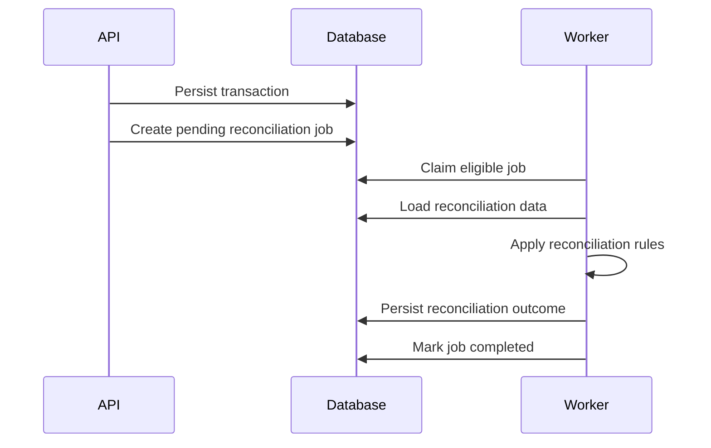
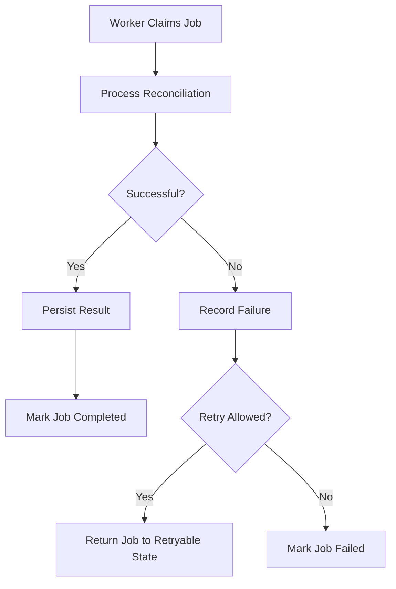
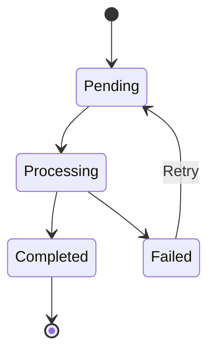
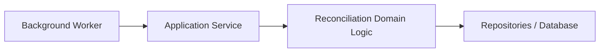

# ADR-0004: Background Processing Strategy

## Status

Accepted

## Context

The payment reconciliation system requires asynchronous processing for reconciliation work.

Transaction ingestion and user-facing API requests should not remain open while potentially long-running reconciliation operations are completed.

Background processing must support:

* Reconciliation job creation
* Independent worker processing
* Job status tracking
* Safe retries
* Idempotent processing
* Failure recovery
* Late-arriving transaction reprocessing
* Multiple workers where required
* Operational visibility into pending, processing, completed, and failed jobs

The initial project should also remain relatively simple to develop, operate, and deploy.

## Options Considered

### Option 1 — PostgreSQL-Backed Job Queue

Store reconciliation jobs in PostgreSQL and allow background workers to claim eligible jobs from the database.

Advantages:

* Uses the database already required by the system.
* Avoids introducing an additional infrastructure service.
* Job state and business data can be coordinated transactionally where appropriate.
* Job status and retry information can be queried using normal database tooling.
* Suitable for the expected scale of the initial project.
* Supports implementation of multiple background workers.
* Keeps local development and deployment relatively simple.

Disadvantages:

* Requires the application to implement or adopt job-claiming, retry, and locking behavior.
* Database polling can add load if implemented inefficiently.
* Does not provide all features of a dedicated message broker.
* Very high background-processing workloads could eventually require a more specialized queue system.

### Option 2 — Redis with a Job Queue Library

Use Redis as the queue infrastructure with a Node.js job-processing library.

Advantages:

* Designed for fast queue and background-job operations.
* Mature libraries provide retries, delays, concurrency, and job lifecycle management.
* Separates job coordination from the relational database.
* Supports multiple workers and scalable background processing.
* Reduces the amount of custom queue behavior the application must implement.

Disadvantages:

* Introduces Redis as an additional infrastructure dependency.
* Requires separate local and deployed configuration.
* Queue state and application data exist in different systems.
* Additional failure and operational scenarios must be considered.
* Adds complexity that may not be necessary for the initial workload.

### Option 3 — Dedicated Message Broker

Use a dedicated messaging system such as RabbitMQ to coordinate reconciliation work.

Advantages:

* Designed specifically for reliable asynchronous message processing.
* Supports acknowledgements and redelivery.
* Provides flexible routing and messaging patterns.
* Suitable for systems with many producers, consumers, and asynchronous workflows.

Disadvantages:

* Introduces substantial additional infrastructure.
* Requires learning and configuring broker-specific concepts.
* Adds operational complexity to local development and deployment.
* Provides capabilities beyond the current requirements.
* May be unnecessarily complex for the initial project scale.

## Decision

The initial system will use a PostgreSQL-backed job queue for reconciliation background processing.

Reconciliation jobs will be persisted in PostgreSQL and processed by one or more independent worker processes.

Workers will claim eligible jobs using database concurrency controls that prevent multiple workers from successfully processing the same job simultaneously.

The queue design will support:

* Pending jobs
* Processing jobs
* Completed jobs
* Failed jobs
* Retry attempts
* Idempotent processing
* Worker concurrency

The background-processing interface should remain sufficiently isolated from reconciliation business logic so that the queue implementation can be replaced later if system requirements change.

## Rationale

The project already requires PostgreSQL for persistent business data.

Using PostgreSQL for initial job coordination avoids introducing another infrastructure service while still allowing the system to demonstrate asynchronous workers, retries, idempotency, concurrency control, and operational job tracking.

The expected project workload does not currently require the throughput or messaging capabilities of a dedicated queue service.

A PostgreSQL-backed approach also allows job state to be inspected using the same database tooling used for the rest of the application.

Redis-based queues and dedicated message brokers remain valid alternatives if future processing volume or messaging requirements exceed what the initial database-backed approach can reasonably support.

## Processing Model

The expected background-processing flow is:

If processing fails:

## Job Lifecycle

The initial job lifecycle is:

Additional states may be introduced if implementation shows that distinctions such as `retry_scheduled` are necessary.

## Job Claiming

A worker must claim a job before processing it.

The claiming mechanism must ensure that two workers cannot both successfully claim the same logical job at the same time.

The exact PostgreSQL locking strategy will be determined during implementation.

Possible approaches include:

* Row-level locking
* Conditional atomic updates
* PostgreSQL locking features appropriate to concurrent job consumers

The implementation should minimize unnecessary blocking between independent workers.

## Retry Behavior

Failed jobs may be retried when the failure is considered recoverable.

A retry should:

* Increment the attempt count.
* Preserve previous failure information where useful.
* Avoid creating duplicate logical reconciliation results.
* Record retry activity for operational or audit purposes.

The system should impose a maximum retry count or equivalent retry policy rather than retrying permanently failing work indefinitely.

The exact retry limit and delay strategy may be refined during implementation and testing.

## Idempotency

Background processing must remain safe if a job is processed more than once.

Duplicate delivery, worker crashes, or retry behavior must not create duplicate logical:

* Transactions
* Reconciliation results
* Reconciliation exceptions
* Audit outcomes

Database uniqueness constraints, transactions, idempotency keys, and application-level state checks should be used together where appropriate.

## Worker Failure

A worker may fail after claiming a job but before completing it.

The system must therefore be able to identify jobs that remain in a processing state without an active worker.

The exact recovery mechanism may use:

* Processing timestamps
* Job leases or timeouts
* Worker heartbeat information
* Periodic recovery checks

The initial implementation should use the simplest mechanism sufficient to identify abandoned work safely.

## Late-Arriving Records

Importing a new transaction may create additional reconciliation work for a transaction that was previously pending or unmatched.

The ingestion process should therefore be capable of creating a new reconciliation job when newly imported data may affect an existing reconciliation state.

Historical reconciliation results should remain preserved.

## Concurrency

Multiple workers should be able to process independent reconciliation jobs concurrently.

Worker concurrency must not allow:

* Duplicate successful processing of the same job.
* Conflicting reconciliation results.
* Invalid exception state changes.
* Corruption of related transaction state.

Database transactions and concurrency controls should enforce these invariants.

## Separation from Reconciliation Logic

Queue and worker infrastructure should coordinate when reconciliation occurs but should not contain the reconciliation rules themselves.

The intended separation is:

This separation allows the same reconciliation logic to remain usable if the background-processing technology changes later.

## Operational Visibility

The system should provide sufficient information to identify:

* Number of pending jobs
* Number of processing jobs
* Number of failed jobs
* Job processing duration
* Retry counts
* Failure reasons
* Old or abandoned processing jobs

This information should contribute to the system's observability and operational dashboard.

## Consequences

### Positive

* No additional queue infrastructure is required initially.
* Local development remains relatively simple.
* Job state can be inspected directly in PostgreSQL.
* API and worker processes can share the same persistence technology.
* The system can still demonstrate asynchronous processing and worker concurrency.
* Reconciliation job updates can use database transactions and constraints.
* The design can evolve toward a dedicated queue later if required.

### Negative

* Some queue behavior must be designed and implemented by the project.
* Polling and job claiming must be implemented carefully.
* Database load may increase as the number of jobs and workers grows.
* Advanced queue features may require additional implementation work.
* Moving to a dedicated queue later would require changes to the background-processing infrastructure.

## Follow-up Decisions

The following decisions remain separate:

* Exact PostgreSQL job-claiming mechanism.
* Worker polling interval.
* Maximum retry count.
* Retry delay or backoff strategy.
* How abandoned processing jobs are detected.
* Whether worker heartbeat information is required.
* How failed jobs are surfaced to administrators.
* How jobs are prioritized, if prioritization becomes necessary.
* Whether a dedicated queue should be introduced if throughput requirements increase.
