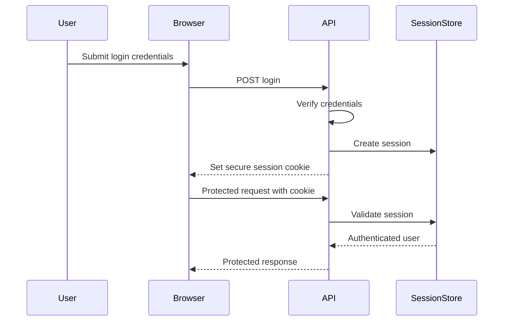
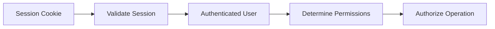

# ADR-0005: Authentication Strategy

## Status

Accepted

## Context

The payment reconciliation system contains protected functionality for Operations Analysts, Operations Managers, and System Administrators.

The application must reliably identify the authenticated user so that the backend can:

* Enforce authorization rules.
* Attribute exception resolutions to the correct user.
* Attribute audit events to the correct actor.
* Restrict administrative actions such as failed-job retries.
* Prevent unauthenticated access to protected reconciliation data.

The primary client is a browser-based web application.

The authentication strategy should:

* Work well with the web application and API.
* Support secure authenticated sessions.
* Integrate with server-side authorization.
* Avoid exposing authentication secrets to client-side JavaScript where practical.
* Support logout and session expiration.
* Remain reasonably simple for the project's initial deployment.
* Avoid unnecessary identity-management infrastructure.

## Options Considered

### Option 1 — Server-Managed Sessions with Secure Cookies

The server creates an authenticated session after successful login.

The browser receives a session identifier in a cookie, and subsequent requests automatically include the cookie.

The server uses the session identifier to determine the authenticated user.

Advantages:

* Well suited to browser-based applications.
* Authentication state can be invalidated by the server.
* Session identifiers can be stored in HTTP-only cookies that are unavailable to normal client-side JavaScript.
* Logout and forced session revocation are straightforward.
* Client code does not need to manually store or attach bearer tokens.
* Integrates naturally with server-side authorization and audit attribution.

Disadvantages:

* Requires server-side session storage or an equivalent session mechanism.
* Cookie-based authentication requires consideration of CSRF protection.
* Session storage must remain available when multiple API instances are used.
* Requires appropriate cookie configuration for production deployment.

### Option 2 — Bearer Tokens / JWTs

The authentication system issues a signed token after login.

The client sends the token with subsequent API requests, typically using an `Authorization` header.

Example:

```http
Authorization: Bearer <token>
```

Advantages:

* Authentication state can be carried with each request.
* Useful for APIs consumed by multiple types of clients.
* Can reduce the need for centralized session lookup.
* Widely supported by authentication libraries and services.
* Works well across separately deployed frontend and API applications.

Disadvantages:

* Secure token storage in browser applications requires careful design.
* Tokens may remain valid until expiration unless explicit revocation mechanisms are added.
* Refresh-token handling can add complexity.
* Token claims may become stale if user roles or permissions change.
* Client-side token handling increases the risk of accidental exposure if implemented poorly.

### Option 3 — Managed Authentication Provider

Use an external authentication service or identity provider to handle authentication.

The provider may handle functionality such as:

* User login
* Password storage
* Session or token issuance
* Password reset
* Account verification

Advantages:

* Reduces the amount of authentication functionality implemented by the application.
* Password handling and credential security can be delegated to specialized infrastructure.
* May provide built-in session management and security features.
* Can simplify advanced identity requirements if they are introduced later.

Disadvantages:

* Introduces an external service dependency.
* Free-tier or pricing constraints may affect deployment.
* Authentication behavior may become coupled to provider-specific APIs or SDKs.
* Adds configuration and deployment dependencies.
* May provide more functionality than the initial project requires.

## Decision

The initial application will use server-managed authentication sessions stored through secure cookies.

After successful authentication, the server will create a session associated with the authenticated user.

The browser will receive a session identifier using a cookie configured with appropriate security attributes.

Protected API requests will derive the authenticated user from the validated server-side session.

The application will not rely on client-supplied user identifiers for authentication or audit attribution.

## Rationale

The primary client for the reconciliation system is a browser-based web application.

Server-managed sessions provide a straightforward authentication model for this architecture and allow the server to retain control over session validity.

Using an HTTP-only cookie reduces the need for client-side JavaScript to access or manually store authentication credentials.

Server-managed sessions also make session invalidation and logout straightforward.

Compared with bearer-token authentication, the initial application does not require authentication across multiple independent client types or third-party API consumers.

Compared with a managed authentication provider, implementing a limited session-based authentication layer avoids introducing another external service dependency for the initial project.

The authentication implementation should remain isolated enough that a managed provider or token-based strategy could be introduced later if requirements change.

## Authentication Flow



## Session Cookie Requirements

The authentication cookie should use appropriate security attributes in deployed environments.

Expected controls include:

* `HttpOnly`
* `Secure`
* An appropriate `SameSite` policy
* Limited scope
* Appropriate expiration

Exact cookie configuration should depend on the final frontend/API deployment topology.

## Session Storage

Session state must be stored somewhere accessible to the API.

Possible implementations include:

* PostgreSQL-backed sessions.
* A dedicated session store introduced later if required.

For the initial application, PostgreSQL-backed session storage is preferred unless implementation constraints indicate otherwise.

This avoids introducing an additional infrastructure dependency solely for authentication.

## Password Handling

If the application stores local user credentials, passwords must never be stored as plain text.

Passwords should be processed using an appropriate password-hashing algorithm intended for password storage.

Password hashes must not be exposed through:

* API responses.
* Application logs.
* Audit records.
* Client-side state.

The exact password-hashing library and parameters should be selected during implementation.

## Authorization Integration

Authentication answers:

> Who is making this request?

Authorization separately answers:

> Is this user allowed to perform this operation?

After session validation, the backend should load or otherwise determine the authenticated user's role and permissions.

Example:



UI restrictions must not replace backend authorization checks.

## Audit Attribution

Protected business actions should derive the actor from the authenticated session.

For example, an exception-resolution request may contain:

```json
{
  "resolutionType": "confirmed_difference",
  "resolutionReason": "Settlement record was verified."
}
```

It should not accept a trusted field such as:

```json
{
  "resolvedByUserId": "user_123"
}
```

The backend should derive `resolvedByUserId` from the authenticated session.

## Session Expiration

Sessions should expire after an appropriate period.

The system should support:

* Session expiration.
* Explicit logout.
* Server-side invalidation of sessions where necessary.

The exact idle and absolute expiration periods should be selected during implementation.

## Logout

Logout should invalidate the server-side session and remove or expire the browser's authentication cookie.

A client deleting its cookie alone should not be treated as the only session-invalidating mechanism.

## CSRF Protection

Because browser cookies may be attached automatically to requests, state-changing API operations must account for Cross-Site Request Forgery risk.

Controls may include:

* Appropriate `SameSite` cookie settings.
* CSRF tokens where required.
* Origin or request-header validation where appropriate.

The exact CSRF controls should be determined once the frontend and API deployment topology is finalized.

## Cross-Origin Considerations

If the web application and API are served from the same origin, session-cookie handling is simpler.

If they are hosted on different origins, the design must explicitly address:

* CORS configuration.
* Credentialed browser requests.
* Cookie domain and `SameSite` behavior.
* CSRF protection.

This is one reason the final web/API deployment boundary remains a related architectural decision.

## Session Revocation

Server-managed sessions should allow the application to invalidate sessions before their normal expiration.

Possible reasons include:

* User logout.
* Account deactivation.
* Security response.
* Role or access changes where immediate re-authentication is required.

## Authentication Failure Responses

Authentication failures should use consistent API responses.

Examples:

```text
401 Unauthorized
```

for missing, invalid, or expired authentication.

Authorization failures should remain distinct:

```text
403 Forbidden
```

when the user is authenticated but lacks permission.

## Security Logging

Authentication-related logging should record useful security events without storing credentials.

Relevant events may include:

* Successful login.
* Failed login.
* Logout.
* Session expiration.
* Session revocation.
* Repeated authentication failures.

Logs must not contain:

* Passwords.
* Password hashes.
* Session identifiers.
* Authentication cookies.

## Consequences

### Positive

* Well suited to the browser-based application.
* Authentication state remains under server control.
* Sessions can be revoked before expiration.
* HTTP-only cookies reduce direct JavaScript access to session credentials.
* Client-side authentication handling remains relatively simple.
* User identity can be reliably used for authorization and audit attribution.
* PostgreSQL can initially support session storage without adding another infrastructure service.

### Negative

* Server-side session state must be stored and managed.
* Cookie-based authentication requires explicit CSRF consideration.
* Multiple API instances must share access to session state.
* Cross-origin frontend/API deployment can make cookie configuration more complex.
* Password-based authentication requires secure password hashing and account-management logic if implemented locally.

## Follow-up Decisions

The following decisions remain separate:

* Which authentication library will be used.
* Which password-hashing implementation will be used.
* Exact session expiration periods.
* Exact session-cookie settings.
* Exact CSRF protection mechanism.
* Whether frontend and API will share the same origin.
* Whether login rate limiting is required.
* Whether account lockout behavior is required.
* How initial demonstration users will be created.
* Whether password reset functionality is required for the MVP.
* Whether authentication should later be delegated to a managed identity provider.
