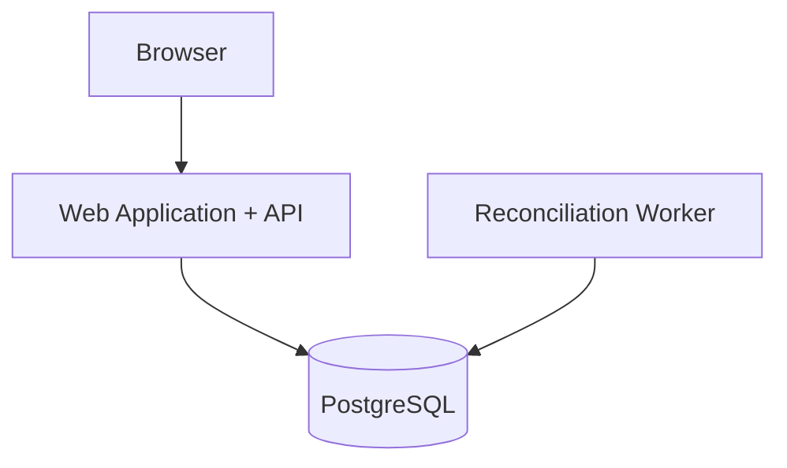
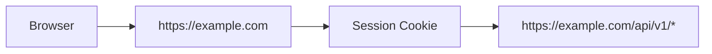
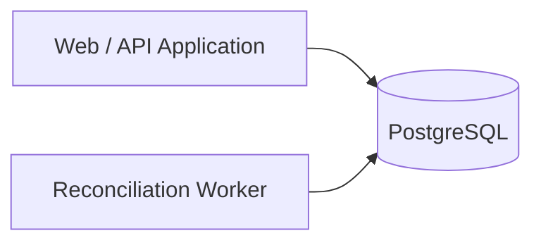
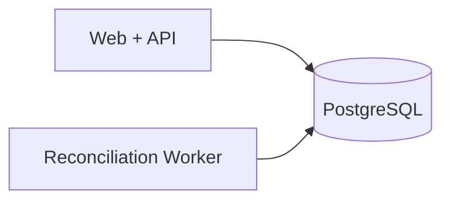
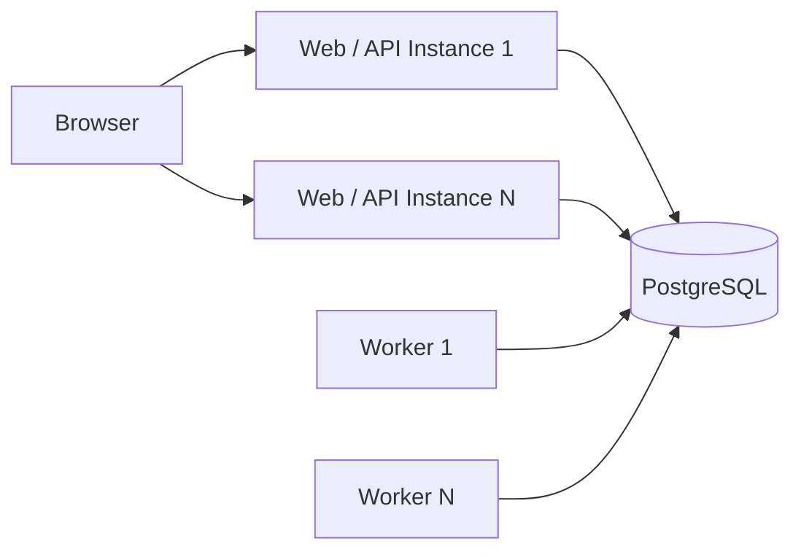

# ADR-0006: Web and API Deployment Boundary

## Status

Accepted

## Context

The payment reconciliation system contains:

* A browser-based web application.
* An HTTP API.
* Application and domain services.
* A background reconciliation worker.
* PostgreSQL-backed persistence.

The system architecture treats the Web Application and Application API as separate logical components.

A deployment decision is required to determine whether the web application and API should also be deployed as separate services or whether they should be deployed together initially.

This decision affects:

* Authentication.
* Session-cookie behavior.
* Cross-origin requests.
* CORS configuration.
* CSRF controls.
* Local development.
* Environment configuration.
* Deployment complexity.
* Independent scaling.
* Operational complexity.

The initial project should remain simple enough to develop and deploy while preserving clear architectural boundaries between presentation, HTTP/API, application, domain, and infrastructure concerns.

## Options Considered

### Option 1 — Deploy Web Application and API Together

The web application and API are deployed as one application or under the same origin.

Example:

```text
https://example.com/
https://example.com/api/v1/transactions
```

Advantages:

* Simplifies same-origin browser requests.
* Simplifies cookie-based authentication.
* Reduces CORS configuration.
* Reduces cross-origin cookie complexity.
* Simplifies local development and environment configuration.
* Requires fewer deployable services.
* Reduces initial infrastructure and operational complexity.
* Suitable for the expected scale of the initial project.

Disadvantages:

* Web and API deployments are coupled.
* Frontend and API cannot be scaled independently as easily.
* A deployment affecting one component may require redeploying the combined application.
* Future separation may require deployment and configuration changes.

### Option 2 — Deploy Web Application and API Separately

The web application and API are independently deployed services.

Example:

```text
https://app.example.com
https://api.example.com
```

Advantages:

* Web and API components can be deployed independently.
* Each component can be scaled independently.
* Clear physical separation between frontend and backend services.
* Supports additional API clients more naturally.
* Allows frontend and backend hosting technologies to be selected independently.

Disadvantages:

* Requires explicit CORS configuration.
* Cookie-based authentication becomes more complex across origins.
* `SameSite`, cookie domain, and credentialed-request behavior must be handled carefully.
* Local development requires coordination between separate services.
* Requires additional deployment and environment configuration.
* Introduces operational complexity not required by the initial project.

## Decision

The initial system will deploy the Web Application and Application API together under the same origin.

The Web Application and API will remain logically separated in the application architecture and codebase even though they share a deployment boundary.

The Reconciliation Worker will run as a separate process because background processing has a different execution lifecycle from user-facing HTTP requests.

The resulting deployment model is:



The worker and Web/API application may share application and domain modules where appropriate, but they should not depend on each other's runtime process.

## Rationale

The primary client is a browser-based web application, and the initial project does not require independent frontend and API scaling.

Deploying the web application and API under the same origin simplifies the session-based authentication strategy defined in ADR-0005.

Same-origin deployment reduces the amount of CORS and cross-origin cookie configuration required and provides a simpler initial security model.

It also reduces the number of services that must be configured, deployed, monitored, and maintained.

The logical separation between the Web Application and Application API remains important even though they share a deployment boundary.

The system should therefore maintain boundaries such as:


The deployment decision should not result in frontend presentation logic and backend business logic becoming tightly coupled.

The background reconciliation worker remains separate because it must continue processing independently of browser requests and HTTP request lifecycles.

## Authentication Impact

The same-origin deployment aligns with the server-managed session strategy.

The browser can receive a secure session cookie from the application and automatically include it when requesting protected API resources on the same origin.

Conceptually:



This avoids the additional cross-origin credential configuration required when the frontend and API are hosted on separate origins.

The application must still implement appropriate protections for cookie-based authentication, including CSRF controls.

## CORS Impact

Normal browser communication between the web application and API should not require cross-origin access because they share the same origin.

CORS should not be enabled broadly unless a specific requirement for external API clients is introduced.

If separate clients are introduced later, allowed origins should be explicitly configured.

## Local Development

Local development should preserve the same logical structure where practical.

For example:



Development tooling may run the web application, API handling, and worker through separate processes even if the final web/API deployment is combined.

The local environment should not require separate frontend and backend deployments solely to reproduce production behavior.

## Application Structure

Sharing a deployment does not mean sharing responsibilities.

The codebase should preserve boundaries between:

* Web presentation.
* API routes and transport handling.
* Application services.
* Reconciliation domain logic.
* Database access.
* Background processing.

For example:

```text
src/
├── web/
├── api/
├── application/
├── domain/
├── infrastructure/
└── workers/
```

The exact folder structure may differ, but the separation of responsibilities should remain.

## Background Worker Boundary

The reconciliation worker will execute independently from the Web/API process.

The intended relationship is:



The Web/API application creates reconciliation work.

The worker claims and processes that work independently.

A Web/API restart should not conceptually require reconciliation processing to be part of the same HTTP request lifecycle.

## Scaling

The initial system does not require independent scaling of the frontend and API.

If HTTP demand increases, additional Web/API application instances may be introduced where supported by the deployment platform.

Background reconciliation capacity should be scalable separately by increasing worker instances.

Conceptually:



Server-managed session state must remain accessible to multiple Web/API instances if horizontal API scaling is introduced.

## Failure Isolation

Combining Web and API deployment means a deployment or failure affecting that application may affect both presentation and HTTP API functionality.

The worker remains independently executable, reducing direct coupling between HTTP availability and background reconciliation processing.

If stronger failure isolation becomes necessary later, the Web Application and API may be separated into independent deployments.

## Future Separation

The architecture should avoid assumptions that would make future separation unnecessarily difficult.

The following boundaries should remain explicit:

* The Web Application communicates with backend functionality through defined API contracts.
* Domain logic does not depend on frontend code.
* API behavior is documented independently of presentation logic.
* Configuration is environment-driven.
* Authentication logic is isolated from presentation components where practical.

If future requirements introduce:

* Multiple frontend clients,
* Third-party API consumers,
* Independent scaling requirements,
* Separate deployment teams,
* Different hosting requirements,

the Web Application and API may be separated into independent services.

Such a change should be recorded through a new ADR that supersedes this decision.

## Consequences

### Positive

* Simpler initial deployment.
* Fewer services to configure and monitor.
* Same-origin authentication is easier to manage.
* Reduced CORS complexity.
* Reduced cross-origin cookie complexity.
* Lower initial infrastructure overhead.
* Web and API can still maintain clear logical boundaries.
* Background workers remain independently scalable.

### Negative

* Web and API deployment lifecycles are coupled.
* Independent frontend and API scaling is less direct.
* A Web/API application failure can affect both UI and API availability.
* Future physical separation may require deployment and configuration changes.

## Follow-up Decisions

The following decisions remain separate:

* Which frontend framework will be used.
* How the Web Application and API will be packaged within the repository.
* Which deployment platform will host the Web/API application.
* How the reconciliation worker will be deployed.
* How shared configuration will be managed.
* How multiple Web/API instances will access shared session state if horizontal scaling is introduced.
* Exact production cookie settings.
* Exact CSRF protection mechanism.
* Whether external API clients will ever be supported.
