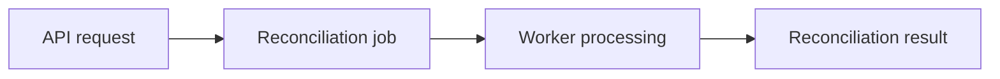

# API Design

## 1. Purpose

This document defines the API design for the payment reconciliation system.

The API provides the primary application boundary for:

* Transaction ingestion
* Transaction retrieval
* Reconciliation result retrieval
* Exception investigation and resolution
* Reconciliation job management
* Dashboard and reporting data
* Audit history
* Health information

This document defines API resources, request and response structures, error conventions, authentication expectations, pagination, filtering, and idempotency behavior.

The implementation framework and hosting environment may be selected separately.

---

## 2. Design Principles

The API should:

* Use resource-oriented HTTP endpoints.
* Use consistent request and response formats.
* Validate all external input.
* Return appropriate HTTP status codes.
* Avoid exposing internal implementation details.
* Support safe retries where applicable.
* Use pagination for potentially large result sets.
* Support filtering and search for operational workflows.
* Preserve traceability through request and correlation identifiers.
* Separate synchronous API responses from long-running reconciliation processing.

---

## 3. Base Path

The API should use a versioned base path:

```text
/api/v1
```

Examples:

```text
/api/v1/transactions
/api/v1/reconciliation-jobs
/api/v1/exceptions
```

Versioning allows future incompatible API changes to be introduced without immediately breaking existing clients.

---

## 4. Data Format

API requests and responses should use JSON unless another format is explicitly required.

Example response:

```json
{
  "id": "txn_123",
  "externalTransactionId": "PAY-1001",
  "amountMinor": 12500,
  "currency": "USD",
  "status": "captured"
}
```

JSON property names should use a consistent naming convention.

For the API contract, camelCase is preferred.

Internal database naming may use a different convention where appropriate.

---

## 5. Authentication

Protected endpoints require an authenticated user.

Authentication details will be finalized in `security-design.md`.

The API should distinguish between:

* Unauthenticated requests
* Authenticated but unauthorized requests

Expected responses:

```text
401 Unauthorized
```

when authentication is missing or invalid.

```text
403 Forbidden
```

when the authenticated user does not have permission to perform the requested operation.

---

## 6. Authorization

Authorization should be enforced by the API rather than relying on the user interface.

Initial roles are:

* Operations Analyst
* Operations Manager
* System Administrator

Example permissions:

| Operation | Analyst | Manager | Administrator |
| --- | --- | --- | --- |
| View transactions | Yes | Yes | Yes |
| View reconciliation results | Yes | Yes | Yes |
| Investigate exceptions | Yes | Yes | Yes |
| Resolve exceptions | Yes | Yes | As explicitly permitted |
| Review dashboard | Yes | Yes | Yes |
| Review audit history | Limited | Yes | Yes |
| Retry failed jobs | No | No | Yes |
| View system health | No | Limited | Yes |

The final permission model should be documented in `security-design.md`.

---

# 7. Transaction Ingestion

## 7.1 Create Transaction

### Endpoint

```http
POST /api/v1/transactions
```

### Purpose

Accept a synthetic transaction record from a supported transaction source.

### Request

```json
{
  "sourceId": "src_payment_processor",
  "externalTransactionId": "PAY-1001",
  "reference": "ORDER-2048",
  "amountMinor": 12500,
  "currency": "USD",
  "transactionType": "payment",
  "status": "captured",
  "occurredAt": "2026-08-27T14:30:00Z"
}
```

### Required Fields

* `sourceId`
* `amountMinor`
* `currency`
* `transactionType`
* `status`
* `occurredAt`

Source-specific identifiers may be required according to the source definition.

### Successful Response

```http
201 Created
```

```json
{
  "data": {
    "id": "txn_01",
    "sourceId": "src_payment_processor",
    "externalTransactionId": "PAY-1001",
    "reference": "ORDER-2048",
    "amountMinor": 12500,
    "currency": "USD",
    "transactionType": "payment",
    "status": "captured",
    "occurredAt": "2026-08-27T14:30:00Z",
    "importedAt": "2026-08-27T14:31:02Z"
  }
}
```

The transaction may be made eligible for asynchronous reconciliation after successful persistence.

---

## 7.2 Batch Transaction Import

### Endpoint

```http
POST /api/v1/import-batches
```

### Purpose

Import multiple synthetic transaction records from one source.

### Request

```json
{
  "sourceId": "src_settlement_system",
  "externalBatchReference": "SETTLEMENT-2026-08-27",
  "transactions": [
    {
      "externalTransactionId": "SET-1001",
      "reference": "ORDER-2048",
      "amountMinor": 12500,
      "currency": "USD",
      "transactionType": "settlement",
      "status": "settled",
      "occurredAt": "2026-08-27T16:00:00Z"
    }
  ]
}
```

### Successful Response

```http
202 Accepted
```

```json
{
  "data": {
    "id": "batch_01",
    "status": "received",
    "totalRecords": 1
  }
}
```

A batch import may continue validation and processing asynchronously.

---

# 8. Transaction Retrieval

## 8.1 List Transactions

### Endpoint

```http
GET /api/v1/transactions
```

### Supported Filters

Possible query parameters include:

```text
sourceId
externalTransactionId
reference
currency
status
transactionType
occurredFrom
occurredTo
```

Example:

```http
GET /api/v1/transactions?currency=USD&status=captured
```

### Successful Response

```json
{
  "data": [
    {
      "id": "txn_01",
      "externalTransactionId": "PAY-1001",
      "reference": "ORDER-2048",
      "amountMinor": 12500,
      "currency": "USD",
      "status": "captured"
    }
  ],
  "pagination": {
    "page": 1,
    "pageSize": 25,
    "totalItems": 1,
    "totalPages": 1
  }
}
```

---

## 8.2 Get Transaction

### Endpoint

```http
GET /api/v1/transactions/{transactionId}
```

### Purpose

Retrieve a specific normalized transaction.

### Successful Response

```http
200 OK
```

```json
{
  "data": {
    "id": "txn_01",
    "sourceId": "src_payment_processor",
    "externalTransactionId": "PAY-1001",
    "reference": "ORDER-2048",
    "amountMinor": 12500,
    "currency": "USD",
    "transactionType": "payment",
    "status": "captured",
    "occurredAt": "2026-08-27T14:30:00Z",
    "importedAt": "2026-08-27T14:31:02Z"
  }
}
```

---

# 9. Reconciliation Jobs

## 9.1 List Reconciliation Jobs

### Endpoint

```http
GET /api/v1/reconciliation-jobs
```

### Supported Filters

* `status`
* `createdFrom`
* `createdTo`

Example:

```http
GET /api/v1/reconciliation-jobs?status=failed
```

---

## 9.2 Get Reconciliation Job

### Endpoint

```http
GET /api/v1/reconciliation-jobs/{jobId}
```

### Example Response

```json
{
  "data": {
    "id": "job_01",
    "status": "completed",
    "attemptCount": 1,
    "createdAt": "2026-08-27T14:31:03Z",
    "startedAt": "2026-08-27T14:31:04Z",
    "completedAt": "2026-08-27T14:31:05Z"
  }
}
```

---

## 9.3 Retry Reconciliation Job

### Endpoint

```http
POST /api/v1/reconciliation-jobs/{jobId}/retry
```

### Purpose

Request reprocessing of an eligible failed reconciliation job.

### Authorization

System Administrator.

### Successful Response

```http
202 Accepted
```

```json
{
  "data": {
    "id": "job_01",
    "status": "pending",
    "attemptCount": 2
  }
}
```

### Possible Errors

* Job not found.
* User not authorized.
* Job is not retryable.
* Job has already completed successfully.

---

# 10. Reconciliation Results

## 10.1 List Reconciliation Results

### Endpoint

```http
GET /api/v1/reconciliation-results
```

### Supported Filters

* `outcome`
* `transactionId`
* `jobId`
* `createdFrom`
* `createdTo`

### Example Outcomes

* `matched`
* `pending`
* `exception`

---

## 10.2 Get Reconciliation Result

### Endpoint

```http
GET /api/v1/reconciliation-results/{resultId}
```

### Example Response

```json
{
  "data": {
    "id": "result_01",
    "jobId": "job_01",
    "outcome": "exception",
    "ruleCode": "AMOUNT_MISMATCH",
    "reason": "Related records contain different transaction amounts.",
    "transactions": [
      {
        "id": "txn_01",
        "role": "payment",
        "amountMinor": 12500,
        "currency": "USD"
      },
      {
        "id": "txn_02",
        "role": "settlement",
        "amountMinor": 12000,
        "currency": "USD"
      }
    ],
    "createdAt": "2026-08-27T14:31:05Z"
  }
}
```

The response should provide sufficient information to explain the reconciliation decision.

---

# 11. Reconciliation Exceptions

## 11.1 List Exceptions

### Endpoint

```http
GET /api/v1/exceptions
```

### Supported Filters

* `status`
* `exceptionType`
* `severity`
* `assignedUserId`
* `createdFrom`
* `createdTo`

Example:

```http
GET /api/v1/exceptions?status=open&exceptionType=amount_mismatch
```

---

## 11.2 Get Exception

### Endpoint

```http
GET /api/v1/exceptions/{exceptionId}
```

### Purpose

Retrieve information required to investigate a reconciliation exception.

### Example Response

```json
{
  "data": {
    "id": "exc_01",
    "reconciliationResultId": "result_01",
    "exceptionType": "amount_mismatch",
    "status": "open",
    "description": "Payment and settlement amounts differ.",
    "assignedUserId": null,
    "transactions": [
      {
        "id": "txn_01",
        "role": "payment",
        "amountMinor": 12500,
        "currency": "USD"
      },
      {
        "id": "txn_02",
        "role": "settlement",
        "amountMinor": 12000,
        "currency": "USD"
      }
    ],
    "createdAt": "2026-08-27T14:31:05Z"
  }
}
```

---

## 11.3 Assign Exception

### Endpoint

```http
PATCH /api/v1/exceptions/{exceptionId}/assignment
```

### Request

```json
{
  "assignedUserId": "user_05"
}
```

### Purpose

Assign an unresolved exception to an authorized operations user.

Assignment may be deferred from the MVP if it is not included in the final scope.

---

## 11.4 Update Exception Status

### Endpoint

```http
PATCH /api/v1/exceptions/{exceptionId}/status
```

### Example Request

```json
{
  "status": "under_investigation"
}
```

Valid state transitions should be enforced according to the business rules.

---

# 12. Exception Resolution

## 12.1 Resolve Exception

### Endpoint

```http
POST /api/v1/exceptions/{exceptionId}/resolution
```

### Request

```json
{
  "resolutionType": "confirmed_difference",
  "resolutionReason": "Settlement amount was confirmed as correct after investigation.",
  "notes": "Source payment record requires correction."
}
```

The resolving user should be derived from the authenticated identity rather than supplied as a trusted request field.

### Successful Response

```http
201 Created
```

```json
{
  "data": {
    "id": "resolution_01",
    "exceptionId": "exc_01",
    "resolutionType": "confirmed_difference",
    "resolutionReason": "Settlement amount was confirmed as correct after investigation.",
    "notes": "Source payment record requires correction.",
    "resolvedByUserId": "user_02",
    "createdAt": "2026-08-27T15:20:00Z"
  }
}
```

The operation should also update the exception state and create the required audit history atomically where practical.

---

# 13. Dashboard

## 13.1 Get Reconciliation Summary

### Endpoint

```http
GET /api/v1/dashboard/reconciliation-summary
```

### Optional Filters

* `from`
* `to`
* `sourceId`
* `currency`

### Example Response

```json
{
  "data": {
    "transactionsProcessed": 10000,
    "matchedTransactions": 9630,
    "pendingTransactions": 120,
    "openExceptions": 180,
    "resolvedExceptions": 70,
    "failedJobs": 4,
    "reconciliationRate": 0.963
  }
}
```

The exact calculation of reconciliation metrics should be defined consistently with the business rules.

---

# 14. Audit History

## 14.1 Get Entity Audit History

### Endpoint

```http
GET /api/v1/audit-events
```

### Supported Filters

* `entityType`
* `entityId`
* `actorUserId`
* `eventType`
* `occurredFrom`
* `occurredTo`

Example:

```http
GET /api/v1/audit-events?entityType=reconciliation_exception&entityId=exc_01
```

### Example Response

```json
{
  "data": [
    {
      "id": "audit_01",
      "actorType": "user",
      "actorUserId": "user_02",
      "eventType": "exception_resolved",
      "entityType": "reconciliation_exception",
      "entityId": "exc_01",
      "occurredAt": "2026-08-27T15:20:00Z"
    }
  ]
}
```

---

# 15. Health Endpoints

## 15.1 Liveness

### Endpoint

```http
GET /api/v1/health/live
```

### Purpose

Indicate whether the application process is running.

Example:

```json
{
  "status": "ok"
}
```

---

## 15.2 Readiness

### Endpoint

```http
GET /api/v1/health/ready
```

### Purpose

Indicate whether the application is capable of serving requests that depend on required services.

Example:

```json
{
  "status": "ready",
  "checks": {
    "database": "available",
    "queue": "available"
  }
}
```

Health responses should avoid exposing sensitive infrastructure details.

---

# 16. Pagination

List endpoints that may return large datasets should support pagination.

Initial request parameters:

```text
page
pageSize
```

Example:

```http
GET /api/v1/transactions?page=2&pageSize=25
```

Example metadata:

```json
{
  "pagination": {
    "page": 2,
    "pageSize": 25,
    "totalItems": 225,
    "totalPages": 9
  }
}
```

The API should impose a maximum page size to prevent excessively large requests.

Cursor-based pagination may be considered later if dataset size or consistency requirements justify it.

---

# 17. Sorting

List endpoints should support sorting where operationally useful.

Example:

```http
GET /api/v1/exceptions?sort=-createdAt
```

A leading `-` may indicate descending order.

Supported sort fields should be explicitly defined per resource to avoid arbitrary database query behavior.

---

# 18. Filtering

Filters should correspond to documented resource attributes.

Examples:

```http
GET /api/v1/transactions?currency=USD
```

```http
GET /api/v1/exceptions?status=open
```

```http
GET /api/v1/reconciliation-jobs?status=failed
```

Invalid or unsupported filter values should produce a validation error rather than being silently ignored where doing so could confuse the caller.

---

# 19. Error Response Format

All API errors should use a consistent response structure.

Example:

```json
{
  "error": {
    "code": "VALIDATION_ERROR",
    "message": "The request contains invalid data.",
    "details": [
      {
        "field": "currency",
        "message": "Currency is required."
      }
    ],
    "requestId": "req_01"
  }
}
```

## Error Fields

* `code` — stable machine-readable classification.
* `message` — safe human-readable explanation.
* `details` — optional structured error information.
* `requestId` — identifier used to correlate the error with diagnostic information.

Internal stack traces or sensitive infrastructure details must not be returned to clients.

---

# 20. HTTP Status Codes

The API should use HTTP status codes consistently.

| Status                    | Meaning                                            |
| ------------------------- | -------------------------------------------------- |
| 200 OK                    | Request completed successfully                     |
| 201 Created               | Resource successfully created                      |
| 202 Accepted              | Request accepted for asynchronous processing       |
| 204 No Content            | Request succeeded with no response body            |
| 400 Bad Request           | Malformed request                                  |
| 401 Unauthorized          | Authentication required or invalid                 |
| 403 Forbidden             | User lacks required permission                     |
| 404 Not Found             | Requested resource does not exist                  |
| 409 Conflict              | Request conflicts with current resource state      |
| 422 Unprocessable Content | Structurally valid request fails domain validation |
| 429 Too Many Requests     | Request rate limit exceeded, if applicable         |
| 500 Internal Server Error | Unexpected server failure                          |
| 503 Service Unavailable   | Required service is temporarily unavailable        |

The distinction between `400` and `422` should be applied consistently.

---

# 21. Domain Error Codes

Stable domain-level error codes should distinguish important failure conditions.

Examples include:

```text
VALIDATION_ERROR
RESOURCE_NOT_FOUND
DUPLICATE_TRANSACTION
INVALID_STATE_TRANSITION
JOB_NOT_RETRYABLE
EXCEPTION_ALREADY_RESOLVED
UNAUTHORIZED_OPERATION
IDEMPOTENCY_CONFLICT
```

These codes allow clients to respond to errors without parsing human-readable messages.

---

# 22. Idempotency

Operations that may be safely retried should support idempotency.

Transaction ingestion and other create operations where duplicate submission is possible may accept:

```http
Idempotency-Key: <unique-key>
```

Example:

```http
POST /api/v1/transactions
Idempotency-Key: import-PAY-1001
```

If the same logical request is repeated with the same idempotency key, the API should avoid creating a duplicate resource.

If the same key is reused with conflicting request data, the API should reject the request with an appropriate conflict response.

The exact storage and expiration behavior for idempotency keys should be defined during implementation or background-processing design.

---

# 23. Asynchronous Operations

Operations requiring background processing should return without waiting for reconciliation to complete.

Example:


Clients should retrieve processing state through reconciliation-job or result endpoints rather than keeping an HTTP request open for the duration of reconciliation.

---

# 24. Concurrency

The API must handle concurrent requests without allowing invalid state changes.

Examples include:

* Two analysts attempting to resolve the same exception.
* Multiple retry requests for the same job.
* Duplicate transaction submissions.
* A late-arriving transaction triggering reconciliation while another attempt is running.

Where relevant, the API should use concurrency controls such as:

* Database transactions
* Unique constraints
* Conditional updates
* Version or state checks
* Idempotency keys

The specific mechanism should be selected based on the persistence design.

---

# 25. Date and Time Representation

API timestamps should use ISO 8601-compatible values with an explicit time-zone offset or UTC representation.

Example:

```text
2026-08-27T15:20:00Z
```

The API should not depend on the client's local timezone to interpret transaction timestamps.

Transaction occurrence time and system import time must remain separate fields.

---

# 26. Monetary Representation

Monetary amounts should be transmitted using an exact representation consistent with the data model.

The initial API design uses integer minor units:

```json
{
  "amountMinor": 12550,
  "currency": "USD"
}
```

which represents:

```text
USD 125.50
```

Clients should not infer currency solely from the amount field.

---

# 27. Request Correlation

API requests should receive or generate a request identifier.

Example response header:

```http
X-Request-ID: req_01
```

Where a synchronous request schedules background reconciliation, relevant correlation information should be propagated so the operation can be traced through:



---

# 28. API Documentation

The implemented API should have machine-readable and human-readable documentation.

An OpenAPI specification should document:

* Endpoints
* HTTP methods
* Request schemas
* Response schemas
* Authentication requirements
* Query parameters
* Error responses
* Example payloads

The OpenAPI definition should reflect the implemented API rather than being maintained as an unrelated artifact.

---

# 29. API Security Considerations

The API design should support:

* Authentication on protected resources.
* Role-based authorization.
* Input validation.
* Payload-size restrictions where appropriate.
* Secure error responses.
* Rate limiting where appropriate.
* HTTPS in deployed environments.
* Safe handling of secrets.
* Protection against unauthorized state changes.

Detailed security decisions should be defined in `security-design.md`.

---

# 30. Endpoint Summary

| Method | Endpoint                                   | Purpose                         |
| ------ | ------------------------------------------ | ------------------------------- |
| POST   | `/api/v1/transactions`                     | Ingest transaction              |
| GET    | `/api/v1/transactions`                     | List/search transactions        |
| GET    | `/api/v1/transactions/{id}`                | View transaction                |
| POST   | `/api/v1/import-batches`                   | Import transaction batch        |
| GET    | `/api/v1/reconciliation-jobs`              | List reconciliation jobs        |
| GET    | `/api/v1/reconciliation-jobs/{id}`         | View job                        |
| POST   | `/api/v1/reconciliation-jobs/{id}/retry`   | Retry failed job                |
| GET    | `/api/v1/reconciliation-results`           | List reconciliation results     |
| GET    | `/api/v1/reconciliation-results/{id}`      | View reconciliation result      |
| GET    | `/api/v1/exceptions`                       | List/search exceptions          |
| GET    | `/api/v1/exceptions/{id}`                  | Investigate exception           |
| PATCH  | `/api/v1/exceptions/{id}/assignment`       | Assign exception                |
| PATCH  | `/api/v1/exceptions/{id}/status`           | Change exception status         |
| POST   | `/api/v1/exceptions/{id}/resolution`       | Resolve exception               |
| GET    | `/api/v1/dashboard/reconciliation-summary` | Retrieve reconciliation metrics |
| GET    | `/api/v1/audit-events`                     | Retrieve audit history          |
| GET    | `/api/v1/health/live`                      | Liveness check                  |
| GET    | `/api/v1/health/ready`                     | Readiness check                 |

---

# 31. API Decisions Requiring Resolution

The following decisions remain open:

1. Which backend framework will implement the API?
2. How will authentication tokens or sessions be managed?
3. Should transaction ingestion return `201 Created` after persistence or `202 Accepted` when reconciliation is also scheduled?
4. Should batch import accept inline transaction data, uploaded files, or both?
5. What maximum batch size should be supported?
6. Which endpoints require rate limiting?
7. Should pagination remain page-based or move to cursor-based pagination?
8. Which filter and sort combinations require database indexes?
9. How long should idempotency keys remain valid?
10. Should exception assignment be included in the MVP?
11. Should manual reconciliation or manual transaction matching be exposed through the API?
12. Should resolved exceptions support reopening?
13. Which audit events should be accessible to each user role?
14. Should API documentation be generated from code, designed contract-first, or use a hybrid approach?

Significant choices may be documented through Architecture Decision Records where appropriate.

---

# 32. Requirement Traceability

The API design primarily supports:

| Concern | Requirements / Use Cases |
| --- | --- |
| Transaction ingestion | FR-001, FR-002, UC-001 |
| Transaction retrieval | FR-008, FR-014, UC-003, UC-004 |
| Reconciliation processing | FR-003–FR-006, UC-002 |
| Exception investigation | FR-007, FR-009, UC-005 |
| Exception resolution | FR-010, UC-006 |
| Job retry | FR-011, FR-018, UC-007 |
| Duplicate protection | FR-012, NFR-005 |
| History and audit | FR-013, FR-017, UC-010 |
| Dashboard | FR-015, UC-009 |
| Monitoring | FR-016, FR-019, UC-008 |
| Security | NFR-011–NFR-016 |
| Explainability | NFR-022 |
| API consistency | NFR-038 |