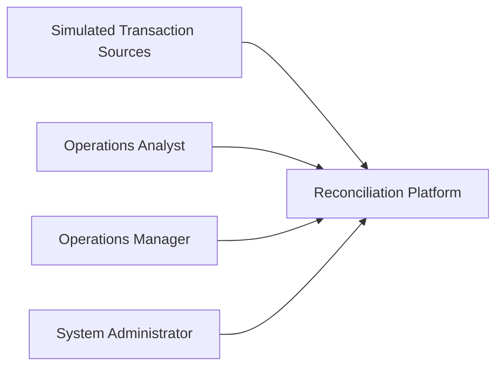

# System Architecture

## 1. Purpose

This document defines the high-level architecture for the payment reconciliation system.

The architecture translates the previously defined requirements, domain model, business rules, and workflows into a technical structure consisting of application components, data stores, background-processing responsibilities, external interfaces, and operational concerns.

This document focuses on major system boundaries and responsibilities. Detailed database schemas, API contracts, security controls, and implementation-specific decisions are documented separately.

---

## 2. Architectural Goals

The architecture should support the following goals:

- Reliable ingestion of synthetic transaction data.
- Deterministic reconciliation of related financial records.
- Clear separation between synchronous user/API operations and asynchronous reconciliation processing.
- Safe retry behavior without duplicate logical results.
- Traceable reconciliation decisions and exception handling.
- Support for late-arriving records.
- Strong data integrity.
- Sufficient observability to diagnose processing failures.
- Maintainable separation of concerns.
- Horizontal scalability for background reconciliation workers.
- Reproducible development and deployment environments.
- Low-cost development and demonstration.

---

## 3. System Context

The reconciliation platform receives synthetic transaction and settlement data from simulated external sources.

Operations users interact with the platform through a web application.

The system processes reconciliation work asynchronously and stores transaction, reconciliation, exception, and audit information in persistent storage.

