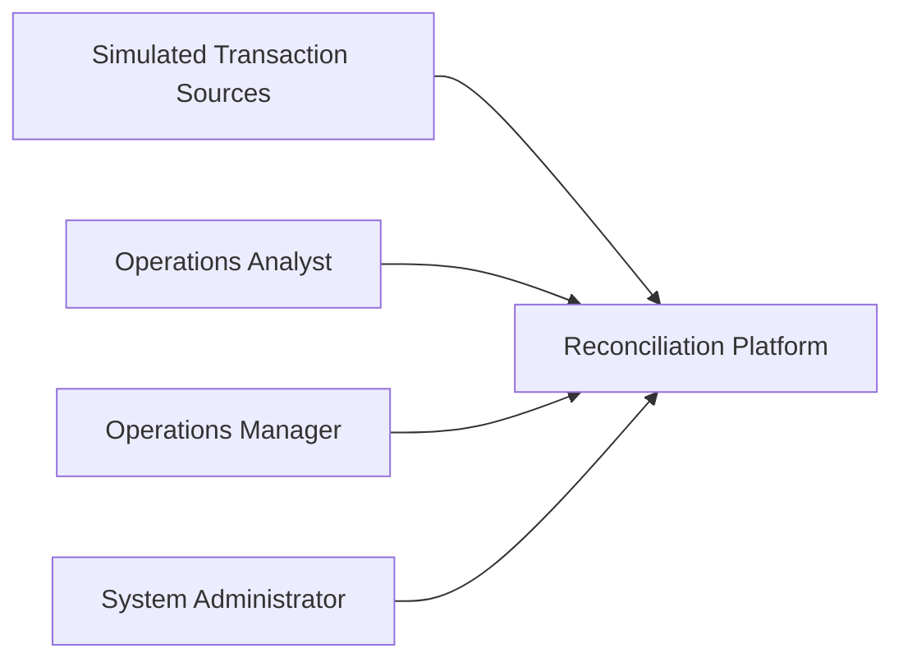
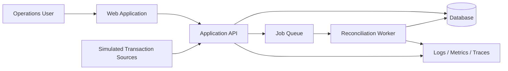
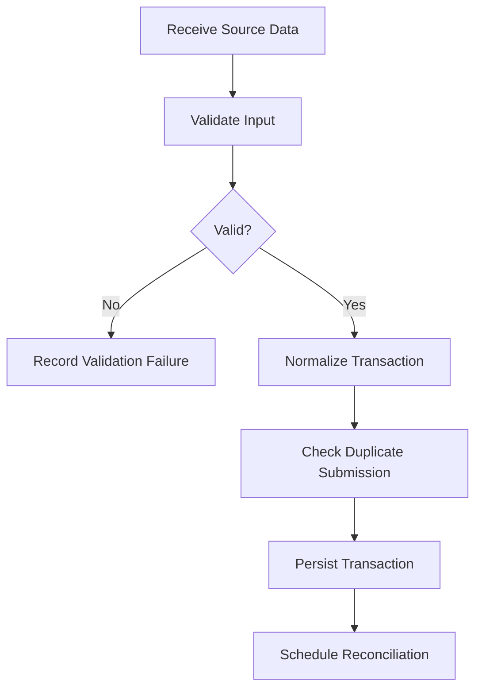
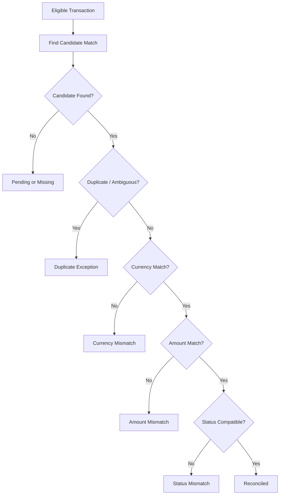
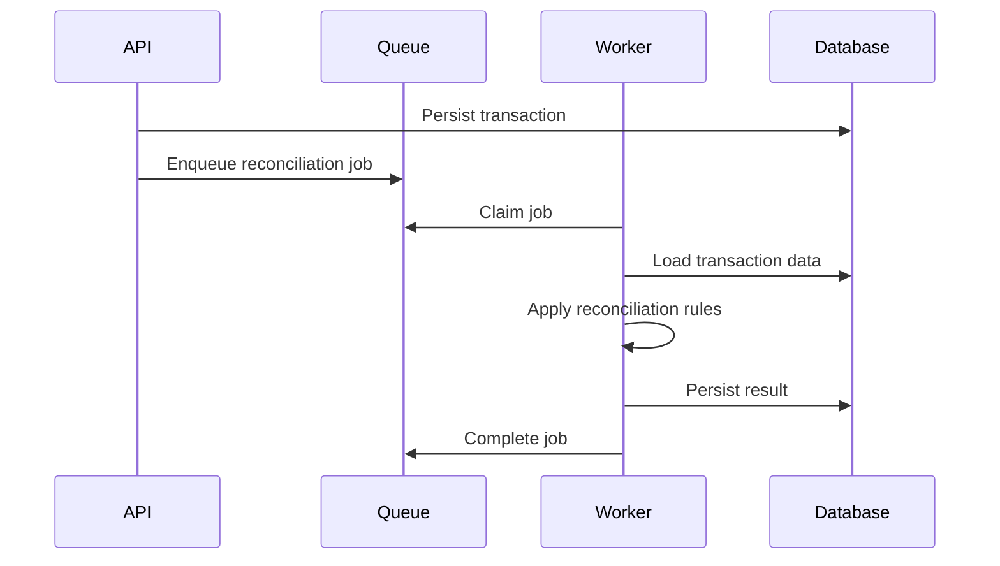
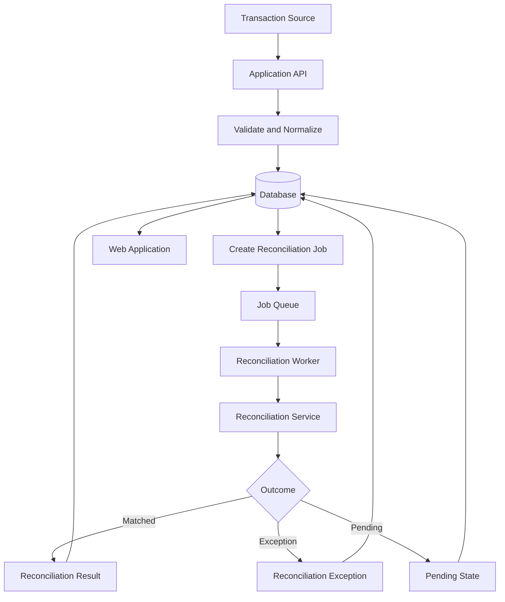
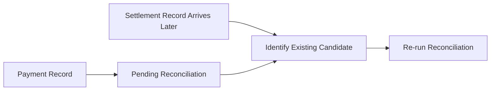
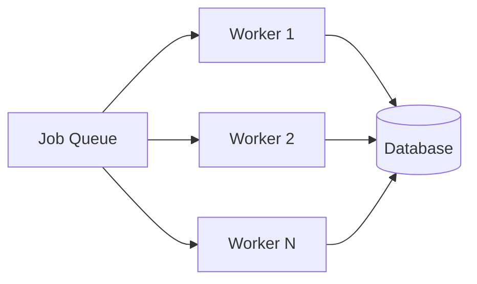
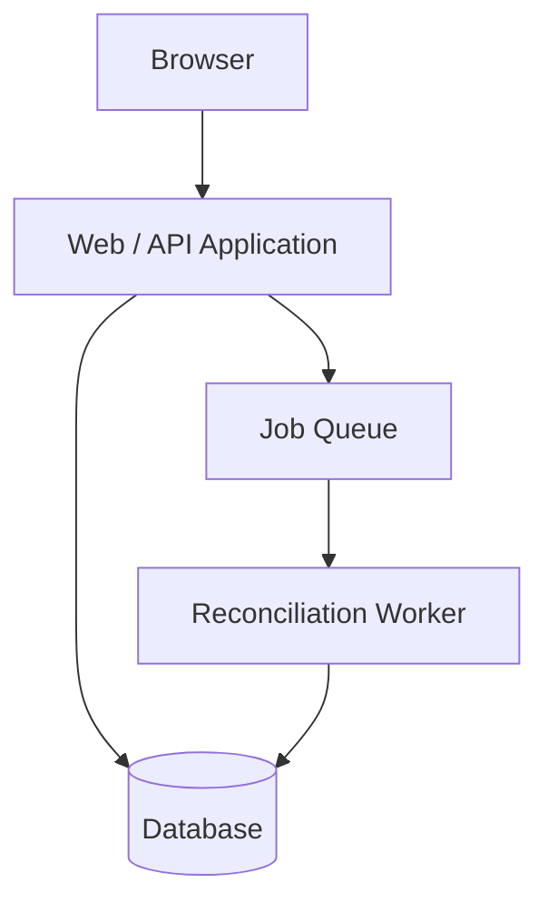

# System Architecture

## 1. Purpose

This document defines the high-level architecture for the payment reconciliation system.

The architecture translates the previously defined requirements, domain model, business rules, and workflows into a technical structure consisting of application components, data stores, background-processing responsibilities, external interfaces, and operational concerns.

This document focuses on major system boundaries and responsibilities. Detailed database schemas, API contracts, security controls, and implementation-specific decisions are documented separately.

---

## 2. Architectural Goals

The architecture should support the following goals:

- Reliable ingestion of synthetic transaction data.
- Deterministic reconciliation of related financial records.
- Clear separation between synchronous user/API operations and asynchronous reconciliation processing.
- Safe retry behavior without duplicate logical results.
- Traceable reconciliation decisions and exception handling.
- Support for late-arriving records.
- Strong data integrity.
- Sufficient observability to diagnose processing failures.
- Maintainable separation of concerns.
- Horizontal scalability for background reconciliation workers.
- Reproducible development and deployment environments.
- Low-cost development and demonstration.

---

## 3. System Context

The reconciliation platform receives synthetic transaction and settlement data from simulated external sources.

Operations users interact with the platform through a web application.

The system processes reconciliation work asynchronously and stores transaction, reconciliation, exception, and audit information in persistent storage.



The system does not connect to real payment processors, financial institutions, or production banking infrastructure.

## 4. High-Level Architecture
The system is divided into the following major components:
1. Web Application
2. Application API
3. Transaction Ingestion Service
4. Reconciliation Service
5. Background Job Worker
6. Persistent Database
7. Job Queue
8. Observability Components



The exact technologies used for each component are architectural decisions that should be recorded separately where significant.

## 5. Web Application
### Responsibility
The Web Application provides the user interface for Operations Analysts, Operations Managers, and System Administrators.

### Primary Capabilities
The application should support:
* Viewing reconciliation results.
* Searching and filtering transaction records.
* Investigating reconciliation exceptions.
* Resolving exceptions.
* Viewing reconciliation summaries.
* Reviewing failed jobs.
* Viewing operational status where authorized.

### Architectural Boundary
The Web Application should not implement core reconciliation business logic.

Business rules and reconciliation decisions should be enforced by backend application services.

## 6. Application API
### Responsibility
The Application API provides the primary interface between the user interface, simulated transaction sources, and backend services.

### Responsibilities
The API should handle:
* Authentication and authorization.
* Transaction ingestion requests.
* Transaction retrieval.
* Reconciliation result retrieval.
* Exception management.
* Job retry requests.
* Dashboard and reporting queries.
* Audit-history retrieval.
* Input validation.
* Error responses.

### Architectural Characteristics
The API should remain stateless where practical.

Persistent business state should be stored in the database rather than relying on local application memory.

Long-running reconciliation operations should not execute directly within normal synchronous API requests.

## 7. Transaction Ingestion

### Responsibility
Transaction ingestion converts source-specific transaction data into the common internal transaction model.

### Processing Steps


### Responsibilities
Transaction ingestion should:
* Identify the transaction source.
* Validate required fields.
* Normalize source-specific representations.
* Preserve original source identifiers.
* Detect duplicate submissions.
* Persist valid transaction records.
* Make eligible transactions available for reconciliation.

## 8. Reconciliation Service
### Responsibility
The Reconciliation Service contains the core business logic used to compare related transactions and determine reconciliation outcomes.

It should remain independent of user-interface concerns and, where practical, infrastructure-specific concerns.

### Responsibilities
The service should:
* Identify candidate related transactions.
* Apply matching rules.
* Detect mismatches.
* Determine successful reconciliation.
* Produce reconciliation results.
* Create reconciliation exceptions where required.
* Support deterministic processing.
* Preserve the reasoning behind reconciliation decisions.

### Logical Processing


The final reconciliation algorithm should be described in greater detail during detailed design or implementation documentation if necessary.

## 9. Background Processing
Reconciliation processing should execute asynchronously.

The API should enqueue reconciliation work rather than performing potentially long-running reconciliation directly during a user request.

### Logical Flow


### Responsibilities
* Background processing should support:
* Pending reconciliation work.
* Worker processing.
* Failure detection.
* Safe retry.
* Idempotent processing.
* Late-arriving transaction reprocessing.
* Multiple workers where required.

Detailed retry, queue, and worker behavior may be extracted into a dedicated ```background-processing.md``` document if the design becomes sufficiently complex.

## 10. Persistent Data
The system requires persistent storage for business and operational state.

Primary persisted entities include:
* Users
* Transaction Sources
* Import Batches
* Transactions
* Reconciliation Jobs
* Reconciliation Results
* Reconciliation Exceptions
* Exception Resolutions
* Audit Events

The database should enforce important data-integrity constraints where practical.

The detailed logical and physical data design should be documented in:

```data-model.md```

## 11. Job Queue
A queue separates transaction ingestion and user-facing requests from asynchronous reconciliation processing.

### Responsibilities
The queue should:
* Hold reconciliation work until a worker can process it.
* Support safe message or job acknowledgement.
* Allow failed work to be retried where appropriate.
* Prevent multiple workers from successfully processing the same logical job simultaneously.
* Support additional workers as processing demand increases.

The specific queue technology should be selected during detailed design.

## 12. Data Flow
A successful reconciliation follows the following high-level flow:


## 13. Component Responsibilities
| Component | Primary Responsibility |
| --- | --- |
| Web Application | Operations user interface |
| Application API | Request handling and application boundary |
| Transaction Ingestion | Validation and normalization |
| Reconciliation Service | Core matching and business rules |
| Job Queue | Asynchronous work coordination |
| Reconciliation Worker | Background job execution |
| Database | Persistent business and operational state |
| Observability | Logs, metrics, traces, health information |

Clear ownership of responsibilities should reduce coupling between system components.

## 14. Architectural Boundaries

### Presentation Boundary
The Web Application is responsible for presentation and user interaction.

It should not determine whether financial records reconcile.

### Application Boundary
The Application API coordinates requests and application operations.

It should delegate reconciliation decisions to domain/application services rather than embedding reconciliation rules directly in controllers or route handlers.

### Domain Boundary
* Domain Boundary
* HTTP
* User-interface frameworks
* Queue implementations
* Database-specific APIs
* Logging providers

Where practical, infrastructure should depend on the reconciliation domain rather than the domain depending directly on infrastructure.

### Infrastructure Boundary
Database access, queue integration, observability providers, and deployment-specific behavior belong to infrastructure concerns.

## 15. Failure Handling
The architecture must assume that failures will occur.

Examples include:

* Invalid transaction input.
* Database failure.
* Worker failure.
* Queue delivery failure.
* Unexpected processing errors.
* Duplicate job delivery.

The system should distinguish between:

### Business Exceptions
Expected reconciliation outcomes such as:
* Amount mismatch
* Currency mismatch
* Duplicate transaction
* Missing counterpart

### Technical Failures
Unexpected failures that prevent processing, such as:
* Database unavailable
* Worker crashes
* Invalid internal state
* Infrastructure failure

Business exceptions should produce reconciliation exceptions.

Technical failures should result in failed or retryable processing state and diagnostic information.

## 16. Idempotency

Operations that may be repeated because of retries or duplicate delivery must be safe to execute more than once.

Examples include:

* Transaction ingestion
* Reconciliation-job execution
* Job retry
* Late-arriving record reprocessing

The architecture should ensure that retrying an operation does not create duplicate logical:
* Transactions
* Reconciliation results
* Exceptions
* Resolution records

Detailed idempotency mechanisms should be defined during data and background-processing design.

## 17. Late-Arriving Data
Transaction records from different sources may arrive at different times.

The architecture must allow a transaction that is currently pending or unmatched to be reconsidered when a relevant new record is later imported.



The exact triggering mechanism for re-reconciliation should be determined during detailed design.

## 18. Security Architecture
The system should apply security controls at appropriate boundaries.

At a high level:
* Users must be authenticated.
* Authorized actions must be role-controlled.
* External input must be validated.
* Secrets must not be stored in source control.
* Deployed communication should use encrypted transport.
* Sensitive internal error details should not be exposed to users.
* Only synthetic financial data should be processed.

Detailed controls should be documented in:
```security-design.md```

## 19. Observability Architecture
Both synchronous API activity and asynchronous reconciliation work should be observable.

The system should provide:
* Structured logs.
* Error information.
* Application metrics.
* Reconciliation metrics.
* Correlation identifiers.
* Health checks.
* Request or processing traces where useful.

A transaction or reconciliation job should be traceable across relevant components sufficiently to determine why processing succeeded or failed.

Detailed observability design may later be documented separately if required.

## 20. Scalability
The architecture should allow processing capacity to increase without fundamentally redesigning the reconciliation logic.

The primary scalability mechanism should be independent background workers.



The reconciliation service should therefore avoid relying on state stored exclusively in a single worker process.

The initial MVP does not require large-scale distributed deployment, but its structure should not unnecessarily prevent future horizontal processing.

## 21. Deployment View
A development or demonstration deployment should conceptually contain:



The exact hosting environment and deployment technology should be selected later based on:

* Cost
* Required capabilities
* Operational simplicity
* Compatibility with the architecture
* Reproducibility

## 22. Architectural Decisions Requiring Resolution
The following decisions remain open:
1. Which frontend framework will be used?
2. Which backend runtime and framework will be used?
3. Which relational database will be used?
4. How will financial values be represented safely?
5. Which queue implementation will coordinate reconciliation work?
6. How will workers claim and acknowledge jobs?
7. How will idempotency keys or equivalent safeguards be implemented?
8. What triggers re-reconciliation for late-arriving records?
9. How will authentication be implemented?
10. How will roles and permissions be represented?
11. Which observability tools will be used?
12. How will development and deployed environments be containerized?
13. Which deployment environment will host the demonstration system?
14. Which infrastructure should be defined through Infrastructure as Code?
15. Should the Web Application and API be deployed as one application or separate services?

Significant decisions should be recorded through Architecture Decision Records where useful.

## 23. Requirement Traceability
The architecture primarily addresses the following requirements:
| Concern | Requirements |
| --- | --- |
| Reconciliation processing | FR-003–FR-007 |
| Exception handling | FR-007, FR-009, FR-010 |
| Job retry | FR-011, FR-012, FR-018 |
| Auditability | FR-013, FR-017 |
| Monitoring | FR-016, FR-019 |
| Reliability | NFR-004–NFR-007 |
| Scalability | NFR-008–NFR-010 |
| Security | NFR-011–NFR-016 |
| Observability | NFR-017–NFR-022 |
| Maintainability | NFR-023–NFR-026 |
| Deployment | NFR-039–NFR-044 |

Detailed traceability should continue to be maintained in the project traceability matrix.

## 24. Design Documents
The architecture establishes the context for the following detailed design documents:
* ```data-model.md```
* ```api-design.md```
* ```security-design.md```

Architecture Decision Records should be used for significant technical choices where documenting alternatives and rationale provides value.