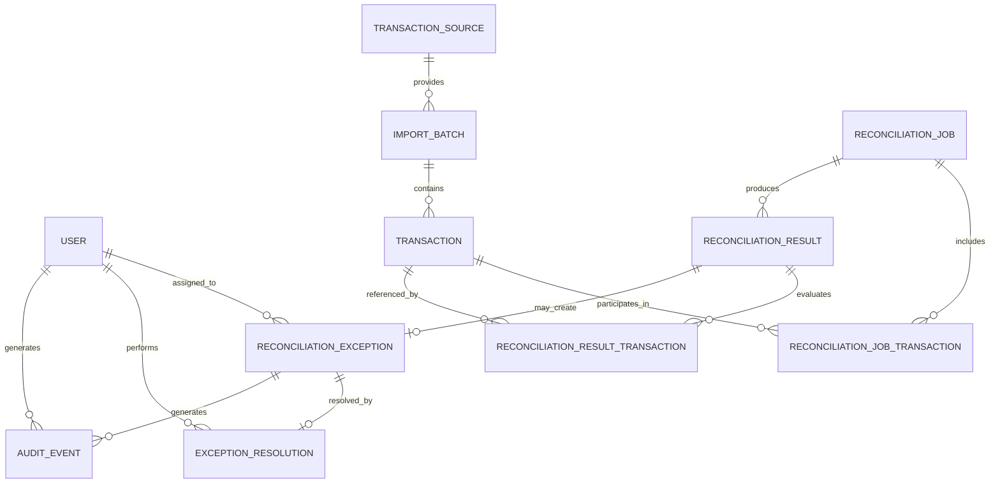
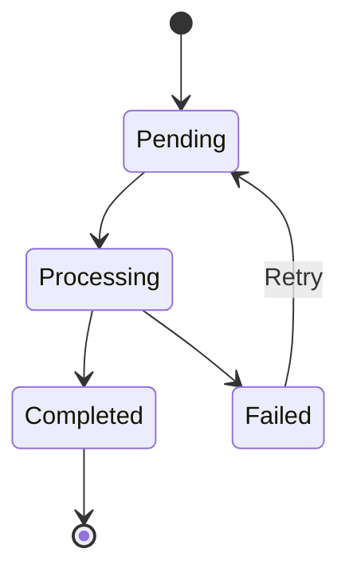
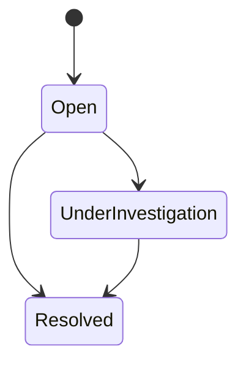

# Data Model

## 1. Purpose

This document defines the logical data model for the payment reconciliation system.

It translates the domain model and business rules into persistent entities, relationships, constraints, and indexing requirements.

The model is intended to support:

- Transaction ingestion
- Reconciliation processing
- Exception handling
- Job retries
- Auditability
- Search and filtering
- Reporting
- Late-arriving transaction processing

The final database-specific schema and migration syntax may vary based on the selected database technology.

---

## 2. Design Principles

The data model should:

- Preserve source traceability.
- Prevent unintended duplicate records.
- Maintain financial precision.
- Support safe retries and idempotent processing.
- Preserve reconciliation history.
- Separate business state from audit history.
- Support efficient reconciliation queries.
- Support operational search and filtering.
- Avoid destructive overwriting of important historical information.

---

## 3. Entity Overview

The primary persisted entities are:

- User
- Transaction Source
- Import Batch
- Transaction
- Reconciliation Job
- Reconciliation Job Transaction
- Reconciliation Result
- Reconciliation Result Transaction
- Reconciliation Exception
- Exception Resolution
- Audit Event

The join entities are included because reconciliation relationships may be many-to-many.

---

## 4. High-Level Data Relationships



This represents the intended logical relationships and does not yet define database-specific foreign-key syntax.

## 5. User
### Purpose
Stores authenticated users who interact with the system.

| Field | Type | Required | Description |
| --- | --- | --- | --- |
| id | Identifier | Yes | Internal unique user identifier |
| name | String |Yes | Display name |
| email | String | Yes | User email address |
| role | Enum | Yes | Analyst, Manager, or Administrator |
| status | Enum | Yes | Active or inactive |
| created_at | Timestamp | Yes | Creation timestamp |
| updated_at | Timestamp | Yes | Last update timestamp |

### Constraints
* ```id``` must be unique.
* ```email``` must be unique.
* ```role``` must contain a supported role value.

## 6. Transaction Source
### Purpose
Represents a simulated system that provides payment or settlement records.

| Field | Type | Required | Description |
| --- | --- | --- | --- |
| id | Identifier | Yes | Internal source identifier |
| name | String | Yes | Source name |
| source_type | Enum/String | Yes | Payment, settlement, or internal |
| status | Enum | Yes | Active or inactive |
| created_at | Timestamp | Yes | Creation timestamp |
| updated_at  | Timestamp | Yes | Last update timestamp |

### Constraints
* Source names should be unique where appropriate.
* A source must exist before its data can be imported.

## 7. Import Batch
### Purpose
Represents a collection of records received from one Transaction Source.

| Field | Type | Required | Description |
| --- | --- | --- | --- |
| id | Identifier | Yes | Internal import-batch identifier |
| source_id | Identifier | Yes | Source providing the batch |
| external_batch_reference | String | No | Source-provided batch identifier |
| status | Enum | Yes | Received, validating, completed, partially completed, failed |
| total_records | Integer | Yes | Number of submitted records |
| valid_records | Integer | Yes | Number of valid records |
| invalid_records | Integer | Yes | Number of invalid records |
| imported_at | Timestamp | Yes | Time the batch was received |
| completed_at | Timestamp | No | Time import processing completed |

### Relationships
* Belongs to one Transaction Source.
* Contains zero or more Transactions.

### Constraints
* ```valid_records + invalid_records``` should not exceed ```total_records```.
* Batch counts must not be negative.

## 8. Transaction
### Purpose
Stores the normalized representation of a payment, settlement, refund, or other supported financial record.

| Field | Type | Required | Description |
| --- | --- | --- | --- |
| id | Identifier | Yes | Internal transaction identifier |
| import_batch_id | Identifier | Yes | Batch containing the record |
| source_id | Identifier | Yes | Source of the transaction |
| external_transaction_id | String | Yes | Source-specific transaction identifier |
| reference | String | No | Business or processor reference |
| amount_minor | Integer | Yes | Monetary amount stored in minor currency units |
| currency | String | Yes | ISO-style currency code |
| transaction_type | Enum | Yes | Payment, settlement, or refund |
| status | String/Enum | Yes | Normalized transaction status |
| occurred_at | Timestamp | Yes | Time the financial event occurred |
| imported_at | Timestamp | Yes | Time the system received the record |
| raw_source_data | Structured Data | No | Optional original source payload |
| created_at | Timestamp | Yes | Record creation timestamp |

### Money Representation
Amounts should be stored using an exact representation.

For the initial design, monetary values are represented as integer minor units.

Examples:
* USD 125.00 → ```12500```
* USD 1.25 → ```125```

This avoids reconciliation errors caused by binary floating-point arithmetic.

If the selected database and application stack use an exact decimal type consistently, this decision may be revisited through an ADR.

### Source Payload Retention

The initial implementation retains the original source payload in `raw_source_data`.

PostgreSQL `jsonb` is used because synthetic source records are represented as structured JSON data.

The normalized Transaction fields remain the authoritative fields used for reconciliation. `raw_source_data` is retained for traceability and investigation and is not initially indexed.

### Constraints
* ```amount_minor``` must use an exact integer representation.
* ```currency``` must be present.
* ```source_id``` must identify a known Transaction Source.
* ```import_batch_id``` must identify the batch through which the record entered the system.

### Duplicate Protection
A uniqueness rule should prevent unintended duplicate ingestion.

A possible logical uniqueness key is:
```source_id + external_transaction_id```

when the source guarantees that the external transaction identifier is unique.

For sources without a reliable identifier, duplicate detection may require a compound rule involving:

* Source
* Reference
* Amount
* Currency
* Timestamp

The exact rule should be source-specific.

### Initial Source Identifier Assumption

The initial synthetic transaction sources provide stable external transaction identifiers that are unique within each source.

The initial schema therefore enforces uniqueness on:

`source_id + external_transaction_id`

Sources without reliable external identifiers may require a different source-specific duplicate-detection rule in the future.

## 9. Reconciliation Job
### Purpose
Represents a unit of asynchronous reconciliation work.
### Fields
| Field | Type | Required | Description |
| --- | --- | --- | --- |
| id | Identifier | Yes | Internal job identifier |
| status | Enum | Yes | Pending, processing, completed, failed |
| idempotency_key | String | Yes | Identifies the logical job operation |
| attempt_count | Integer | Yes | Number of processing attempts |
| failure_code | String | No | Stable failure classification |
| failure_message | String | No | Human-readable diagnostic summary |
| created_at | Timestamp | Yes | Job creation time |
| started_at | Timestamp | No | Current/latest processing start |
| completed_at | Timestamp  | No | Successful completion time |
| failed_at | Timestamp | No | Latest failure time |

### Constraints
* ```idempotency_key``` must be unique for a logical reconciliation job.
* ```attempt_count``` must not be negative.
* A completed job must have ```completed_at```.
* A failed job should contain failure information.

## 10. Reconciliation Job Transaction
### Purpose
Associates reconciliation jobs with the transactions they process.

This join entity avoids assuming that every reconciliation job processes exactly one transaction.

### Fields
| Field | Type | Required | Description |
| --- | --- | --- | --- |
| reconciliation_job_id | Identifier | Yes | Related job |
| transaction_id | Identifier | Yes | Related transaction |
| created_at | Timestamp | Yes | Association creation time |

### Constraints
The pair:

```reconciliation_job_id + transaction_id```

must be unique.

## 11. Reconciliation Result
### Purpose
Stores the logical outcome of a reconciliation attempt.

### Fields
| Field  | Type | Required | Description |
| --- | --- | --- | --- |
| id | Identifier | Yes | Internal result identifier |
| reconciliation_job_id | Identifier | Yes | Job producing the result |
| outcome | Enum | Yes | Matched, pending, exception |
| rule_code | String | Yes | Rule that determined the outcome |
| reason | String | No | Human-readable explanation |
| created_at | Timestamp  | Yes | Result creation time |

### Constraints
* Every result must reference a reconciliation job.
* Every result must identify the rule responsible for the decision.
* The result should be immutable once finalized, except through explicitly designed correction workflows.


## 12. Reconciliation Result Transaction
### Purpose
Associates the transactions that were evaluated as part of a ReconciliationResult.

### Fields
| Field | Type | Required | Description |
| --- | --- | --- | --- |
| reconciliation_result_id | Identifier  | Yes | Related result |
| transaction_id | Identifier  | Yes | Evaluated transaction |
| role | String/Enum | No | Optional role such as source, counterpart, payment, settlement |
| created_at | Timestamp | Yes | Association creation time |

### Constraints
The combination of:

```reconciliation_result_id + transaction_id```

must be unique.

## 13. Reconciliation Exception
### Purpose
Stores a reconciliation condition requiring investigation or operational handling.

### Fields
| Field | Type | Required | Description |
| --- | --- | --- | --- |
| id | Identifier |Yes | Internal exception identifier |
| reconciliation_result_id | Identifier | Yes | Result that produced the exception |
| exception_type | Enum | Yes | Amount mismatch, currency mismatch, or duplicate |
| severity | Enum | No | Optional severity |
| status | Enum | Yes | Open, under investigation, resolved |
| description | String | Yes | Explanation of the exception |
| assigned_user_id | Identifier | No | Analyst currently assigned |
| created_at | Timestamp  | Yes | Creation timestamp |
| updated_at | Timestamp | Yes | Last update timestamp |
| resolved_at | Timestamp  | No | Resolution time |

### Constraints
* An exception must reference a reconciliation result.
* A resolved exception must have a resolution record.
* resolved_at should only be present for resolved exceptions.

## 14. Exception Resolution
### Purpose
Records the manual resolution of a reconciliation exception.

### Fields
| Field | Type | Required | Description |
| --- | --- | --- | --- |
| id | Identifier | Yes | Internal resolution identifier |
| exception_id | Identifier | Yes | Exception being resolved |
| resolved_by_user_id | Identifier | Yes | User performing the resolution |
| resolution_type | String/Enum | Yes | Resolution classification |
| resolution_reason | String | Yes | Explanation of the resolution |
| notes | String | No | Additional notes |
| created_at | Timestamp | Yes | Resolution timestamp |

### Constraints
* A resolution must belong to an existing exception.
* A resolution must identify the resolving user.
* The initial MVP should allow at most one active/final resolution per exception.

If reopening is later supported, resolution history may require a one-to-many relationship instead.

## 15. Audit Event
### Purpose
Stores immutable records of significant user or system actions.

### Fields
| Field | Type | Required | Description |
| --- | --- | --- | --- |
| id | Identifier | Yes | Audit-event identifier |
| actor_user_id  | Identifier | No | User responsible, if applicable |
| actor_type | Enum | Yes | User, system, worker |
| event_type | String | Yes | Stable event classification |
| entity_type | String | Yes | Type of affected entity |
| entity_id | Identifier/String | Yes | Identifier of affected entity |
| previous_state | Structured Data | No | Relevant state before the event |
| new_state | Structured Data | No | Relevant state after the event |
| metadata | Structured Data | No | Additional contextual information |
| occurred_at | Timestamp | Yes | Event timestamp |

### Constraints
Audit records should be append-only through normal application workflows.

Existing audit events should not be silently overwritten.

## 16. Reconciliation State Model
### Job States



### Exception States


A reopening transition may be introduced later if required.

## 17. Idempotency Design
Idempotency must be supported at multiple persistence boundaries.

### Transaction Ingestion
Duplicate ingestion should be prevented using a source-specific unique identifier or equivalent idempotency key.

Where the source provides a stable external transaction identifier, the preferred logical uniqueness constraint is:

```source_id + external_transaction_id```

### Reconciliation Jobs
Each logical reconciliation request should have a stable ```idempotency_key```.

A repeated request using the same key should reuse or safely reference the existing logical job instead of creating duplicate reconciliation work.

### Reconciliation Results
A retry of the same logical reconciliation operation must not create duplicate final results.

The final mechanism may use:
* Unique constraints
* Transactional writes
* Job idempotency keys
* Result uniqueness rules

The exact implementation should be finalized with the selected persistence and queue technologies.

## 18. Late-Arriving Data
The data model must support a transaction being reconciled again when a relevant counterpart arrives later.

A transaction may therefore participate in multiple reconciliation jobs or attempts over time.

Historical results should be preserved rather than overwritten.

Example:


This history allows the system to explain how reconciliation state changed over time.

## 19. Indexing Strategy
Indexes should support the most frequent lookup and reconciliation patterns.

Likely indexes include:
### Transaction
* ```source_id```
* ```external_transaction_id```
* ```reference```
* ```currency```
* ```occurred_at```
* ```status```
* ```(source_id, external_transaction_id)```
* ```(reference, currency, amount_minor)```

### Reconciliation Job
* ```status```
* ```created_at```
* ```idempotency_key```

### Reconciliation Result
* ```reconciliation_job_id```
* ```outcome```
* ```created_at```

### Reconciliation Exception
* ```status```
* ```exception_type```
* ```assigned_user_id```
* ```created_at```

### Audit Event
* ```(entity_type, entity_id)```
* ```actor_user_id```
* ```occurred_at```

Indexes should be validated against actual query patterns rather than added indiscriminately.

## 20. Search and Filtering Support
The data model must support filtering reconciliation activity by:
* Transaction identifier
* Reference
* Source
* Date or date range
* Currency
* Transaction status
* Reconciliation outcome
* Exception type
* Exception status
* Assigned analyst
* Job status
The final query design should avoid requiring full-table scans for common operational workflows.

## 21. Data Retention and History
Important reconciliation history should be preserved.

The system should avoid destructive deletion of:
* Reconciliation results
* Exception resolutions
* Audit events
Transactions or other records should not be physically removed if doing so would break reconciliation or audit history.

The project does not currently define a formal retention period because all project data is synthetic.

## 22. Transactional Consistency
Operations that change multiple related records should use atomic database transactions where appropriate.

Examples include:

### Successful Reconciliation
A successful operation may need to atomically:
1. Create the Reconciliation Result.
2. Associate relevant Transactions.
3. Update the Reconciliation Job.
4. Create relevant Audit Events.

### Exception Creation
An exception-producing operation may need to atomically:
1. Create the Reconciliation Result.
2. Associate the evaluated Transactions.
3. Create the Reconciliation Exception.
4. Update the Reconciliation Job.
5. Create relevant Audit Events.

Partial persistence should not leave the system representing incomplete reconciliation work as successfully completed.

## 23. Data Integrity Constraint
### Final Schema
The final schema should enforce appropriate constraints including:
* Primary keys.
* Foreign keys.
* Unique source transaction identifiers where supported.
* Unique reconciliation idempotency keys.
* Valid enumeration values.
* Non-null required fields.
* Valid financial amounts.
* Valid currency identifiers.
* Referential integrity between results, jobs, exceptions, and transactions.

Application validation should complement rather than replace database constraints.

### Identifier Strategy

Persisted entities use UUID primary keys generated by the database.

## 24. Data Model Decisions Requiring Resolution
The following decisions remain open:
1. Which relational database will be used?
2. Should monetary values remain integer minor units or use an exact decimal database type?
3. If raw payloads are retained, how should they be structured and indexed?
4. Can one transaction participate in multiple successful reconciliation results?
5. How should superseded or historical results be identified?
6. Should resolution history support multiple resolutions if an exception is reopened?
7. How should validation failures be persisted?
8. Should reconciliation status exist directly on Transaction, or be derived from reconciliation results?
9. Which source identifiers are sufficiently reliable to support database uniqueness constraints?
10. How should concurrent workers coordinate access to the same reconciliation candidates?

Significant technical decisions should be documented through Architecture Decision Records where appropriate.

## 25. Requirement Traceability
The data model primarily supports:

| Concern | Requirements / Rules |
| --- | --- |
| Transaction ingestion | FR-001, FR-002, BR-043, BR-044 |
| Duplicate prevention | FR-012, NFR-005, BR-018–BR-020 |
| Reconciliation | FR-003–FR-007, BR-005–BR-017 |
| Exception management | FR-007, FR-009, FR-010 |
| Job retry | FR-011, FR-018, BR-024–BR-026 |
| Auditability | FR-013, FR-017, BR-034–BR-038 |
| Financial precision | BR-004, BR-045 |
| Late-arriving records | BR-049, WF-007 |
| Data integrity | NFR-007, BR-043–BR-047 |
| Search and filtering | FR-014 |

