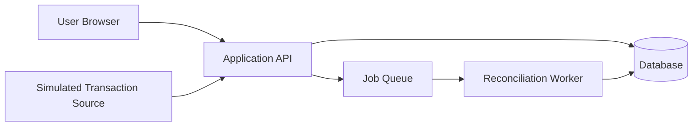
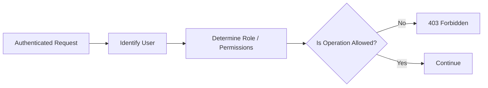
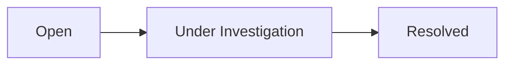
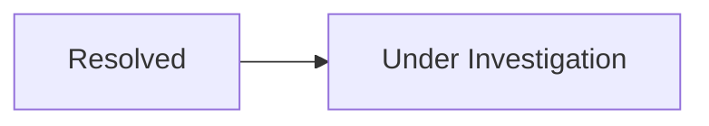
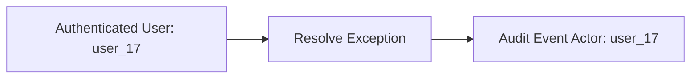

# Security Design

## 1. Purpose

This document defines the security design for the payment reconciliation system.

The design describes how the system protects:

* User access
* API operations
* Reconciliation state
* Audit information
* Application secrets
* Synthetic financial data
* Operational and administrative actions

The system processes synthetic financial data only and does not connect to real banking or payment infrastructure.

---

## 2. Security Objectives

The security design should ensure that:

* Only authenticated users can access protected system functionality.
* Users can perform only actions permitted by their roles.
* External input is validated before processing or persistence.
* Sensitive application secrets are not exposed through source code or API responses.
* Significant user actions are auditable.
* Reconciliation state cannot be modified through unauthorized requests.
* Duplicate or replayed requests do not create unintended financial records or reconciliation outcomes.
* Internal system errors do not expose sensitive implementation details.
* Synthetic financial data remains clearly separated from real financial information.

---

## 3. Security Boundaries

The primary security boundaries are:



Requests crossing into the Application API boundary must be treated as untrusted until validated and authorized.

Background workers should not assume that persisted or queued input is automatically safe without appropriate validation and state checks.

---

# 4. Authentication

## Objective

Identify users before allowing access to protected system resources.

## Requirements

Protected endpoints should require authenticated identity.

Authentication should provide the API with a reliable user identifier that can be used for:

* Authorization
* Audit attribution
* Exception assignment
* Exception resolution
* Administrative operations

The specific authentication mechanism may be selected during implementation.

Possible approaches include:

* Server-managed sessions
* Signed access tokens
* An authentication library or managed identity provider

The final choice should be documented through an Architecture Decision Record if the tradeoffs are significant.

---

## 5. Authorization

Authorization should be enforced on the server.

The web application may hide unavailable actions for usability, but UI restrictions must not be treated as security controls.

Initial roles are:

* Operations Analyst
* Operations Manager
* System Administrator

### Permission Matrix

| Operation | Analyst | Manager | Administrator |
| --- | --- | --- | --- |
| View transactions | Yes | Yes | Yes |
| View reconciliation results | Yes | Yes | Yes |
| Search reconciliation records | Yes | Yes | Yes |
| Investigate exceptions | Yes | Yes | Yes |
| Resolve exceptions | Yes | Yes | Only if explicitly allowed |
| Assign exceptions | Yes, if enabled | Yes | Only if explicitly allowed |
| View reconciliation dashboard | Yes | Yes | Yes |
| View audit history | Limited | Yes | Yes |
| View failed reconciliation jobs | No | Limited | Yes |
| Retry failed jobs | No | No | Yes |
| View operational health information | No | Limited | Yes |

Permissions may be refined as the workflow is finalized.

---

## 6. Least Privilege

Users and system components should receive only the permissions required to perform their responsibilities.

Examples:

* An Operations Analyst should not be able to retry failed infrastructure jobs.
* A System Administrator should not automatically be able to alter reconciliation outcomes merely because they administer the system.
* A reconciliation worker should not require user-management privileges.
* A read-only dashboard operation should not require mutation permissions.

---

## 7. API Authorization

Every protected API operation should verify authorization before performing the requested action.

Example:



Authorization checks should occur in the backend even if the frontend already restricts the relevant UI action.

---

# 8. Input Validation

All external input should be treated as untrusted.

Input requiring validation includes:

* Transaction ingestion payloads
* Batch imports
* Query parameters
* Path identifiers
* Exception-resolution requests
* Assignment requests
* Status changes
* Retry requests

Validation should verify:

* Required fields
* Field types
* Allowed values
* Length limits
* Numeric ranges
* Date and time formats
* Supported currencies
* Supported transaction statuses
* Valid state transitions

---

## 9. Domain Validation

Structurally valid input may still violate business rules.

For example:

```json
{
  "amountMinor": 12500,
  "currency": "USD"
}
```

may be structurally valid.

However, a request attempting to resolve an already resolved exception may be invalid according to the domain rules.

The system should distinguish between:

* Input/schema validation
* Business-rule validation
* Authorization failure

These conditions should produce appropriate API errors.

---

# 10. Injection Protection

Database queries should use parameterized queries or equivalent safe database-access mechanisms.

Untrusted input should not be concatenated directly into database query strings.

Dynamic filtering and sorting should use explicit allowlists.

For example, if the API supports:

```http
GET /api/v1/exceptions?sort=-createdAt
```

the server should map `createdAt` to a known supported field rather than treating arbitrary client-provided text as executable query syntax.

---

# 11. Mass Assignment Protection

API request objects should not be persisted directly without controlling which fields the client is allowed to set.

For example, a resolution request may contain:

```json
{
  "resolutionType": "confirmed_difference",
  "resolutionReason": "Settlement record was verified."
}
```

The client should not be allowed to provide trusted fields such as:

```json
{
  "resolvedByUserId": "some-other-user",
  "createdAt": "2020-01-01T00:00:00Z"
}
```

Trusted values such as the resolving user and server timestamps should be derived by the application.

---

# 12. State Transition Protection

Mutation endpoints should enforce valid state transitions.

Examples include:



The API should reject invalid transitions such as:



unless reopening is explicitly supported by the business rules.

State-transition validation should occur atomically with persistence where practical.

---

# 13. Concurrency Protection

Security and integrity controls should account for concurrent actions.

For example, two analysts might attempt to resolve the same exception simultaneously.

The system should prevent both requests from independently succeeding.

Possible controls include:

* Conditional database updates
* Transactions
* Optimistic concurrency checks
* State/version validation

The exact mechanism should be selected with the persistence design.

---

# 14. Idempotency and Replay Protection

Operations that may be retried should not create duplicate logical state.

Relevant operations include:

* Transaction ingestion
* Batch submission
* Reconciliation-job processing
* Failed-job retry

Where appropriate, requests may include an idempotency key.

Example:

```http
Idempotency-Key: import-PAY-1001
```

A repeated request with the same key and same logical payload should not create a second transaction.

Reuse of the same key with materially different data should be rejected.

---

# 15. Synthetic Financial Data

The project must use synthetic financial information only.

The system shall not require, store, or process:

* Real payment-card numbers
* Real bank account numbers
* Real payment gateway credentials
* Real banking credentials
* Production payment tokens
* Real customer financial records

Synthetic records should be clearly generated for demonstration and testing.

---

# 16. Monetary Data

Even though the project uses synthetic data, financial values should be handled with production-appropriate integrity.

The system should:

* Preserve currency together with monetary values.
* Use exact monetary representation.
* Reject malformed monetary values.
* Prevent unauthorized modification of persisted transaction amounts.

Reconciliation outcomes should be derived from persisted transaction data rather than trusted values supplied by the frontend.

---

# 17. Secrets Management

Secrets must not be committed to source control.

Examples include:

* Database credentials
* Authentication secrets
* API signing keys
* Queue credentials
* Observability service tokens
* Deployment credentials

Development configuration should use environment variables or another appropriate configuration mechanism.

The repository may include:

```text
.env.example
```

containing placeholder names but no usable secrets.

Example:

```text
DATABASE_URL=
AUTH_SECRET=
QUEUE_URL=
```

---

# 18. Credential Rotation

The design should allow secrets to be replaced without requiring source-code changes.

If a secret is accidentally exposed, it should be treated as compromised and replaced.

Configuration should therefore remain separate from application source code.

---

# 19. Transport Security

Deployed application traffic should use HTTPS.

Unencrypted HTTP should not be used for authenticated application traffic in deployed environments.

The system should rely on the deployment environment or reverse proxy to provide TLS where appropriate.

---

# 20. Error Handling

Client-facing errors should provide enough information for the client to understand the failure without exposing sensitive internal details.

Safe example:

```json
{
  "error": {
    "code": "INTERNAL_ERROR",
    "message": "The request could not be completed.",
    "requestId": "req_01"
  }
}
```

Unsafe information includes:

* Stack traces
* SQL queries
* Database credentials
* Internal file paths
* Environment variables
* Authentication secrets
* Infrastructure addresses not intended for clients

Detailed error information should instead be available through protected logs or error-tracking systems.

---

# 21. Logging Security

Logs must not contain secrets or sensitive credentials.

Values that should not be logged include:

* Authentication tokens
* Passwords
* Session secrets
* Database credentials
* Private keys
* Authorization headers

The project uses synthetic financial data, but logging should still follow safe practices appropriate to production systems.

Logs should provide identifiers such as:

* Request ID
* Job ID
* Transaction ID
* Reconciliation Result ID
* Exception ID

so failures can be investigated without logging unnecessary payload content.

---

# 22. Audit Logging

Significant business and administrative actions should generate audit events.

Examples include:

* Exception assignment
* Exception status changes
* Exception resolution
* Reconciliation job retry
* Relevant administrative changes

Audit records should identify:

* Actor
* Event type
* Entity
* Timestamp
* Previous state where applicable
* New state where applicable

Audit events should be append-only through normal application workflows.

---

# 23. Audit Attribution

User-generated audit actions must derive the actor identity from the authenticated session or token.

The API must not trust the client to supply the identity of the person performing a protected action.

For example:



---

# 24. Authentication Data

Passwords should not be stored directly by application code.

If the chosen authentication system requires local password storage, passwords must be processed using an appropriate password-hashing algorithm designed for password storage.

If authentication is delegated to a managed authentication system, the reconciliation application should avoid storing password credentials itself.

The final approach depends on the authentication technology selected.

---

# 25. Session and Token Security

If sessions are used:

* Session identifiers should be unpredictable.
* Cookies containing authentication state should use secure attributes appropriate to the deployment.
* Session expiration should be enforced.

If bearer tokens are used:

* Tokens should have appropriate expiration.
* Signing or verification keys must remain secret where required.
* Tokens should not be logged.
* Token validation must occur on protected requests.

The chosen model should be documented once authentication technology is selected.

---

# 26. Cross-Site Scripting Protection

User-controlled text rendered by the web application should not be interpreted as executable HTML or JavaScript.

Potentially user-controlled content includes:

* Resolution notes
* Exception descriptions
* Search parameters reflected in the UI

The frontend should use framework-safe rendering behavior and avoid unnecessary raw HTML injection.

---

# 27. Cross-Site Request Forgery

If authentication relies on browser cookies that are automatically attached to requests, state-changing operations should be protected against cross-site request forgery where necessary.

If authentication uses a different model, the relevant CSRF risk should be evaluated accordingly.

The final control depends on the chosen authentication architecture.

---

# 28. Cross-Origin Access

Cross-origin access should be restricted to trusted origins required by the deployed application.

The API should not enable unrestricted cross-origin access without a specific reason.

If the frontend and API are served from the same origin, cross-origin configuration may not be necessary for normal browser access.

---

# 29. Rate Limiting and Abuse Protection

Rate limits should be considered for endpoints that could be abused or create significant work.

Candidates include:

* Authentication endpoints
* Transaction ingestion
* Batch import
* Failed-job retry

Rate limiting is not necessarily required for every endpoint in the MVP.

The final design should consider expected usage, cost, and abuse risk.

---

# 30. Payload Limits

The API should enforce reasonable request-size limits.

This is especially relevant for batch transaction ingestion.

Oversized requests should be rejected rather than consuming unbounded memory or processing capacity.

The maximum batch and payload sizes should be determined during implementation and performance testing.

---

# 31. Background Worker Security

Reconciliation workers should operate with only the permissions they require.

Workers should be able to:

* Read relevant reconciliation data.
* Process reconciliation jobs.
* Persist reconciliation results.
* Create business exceptions.
* Update job processing state.
* Produce operational telemetry.

Workers should not require unrelated administrative privileges.

Queued job payloads should contain only the information needed to identify and process the work.

---

# 32. Queue Security

If the queue is provided by an external or network-accessible service:

* Access should require authentication where supported.
* Credentials should be stored through the normal secrets-management mechanism.
* Queue access should not be publicly exposed.
* Workers and producers should receive only the permissions they require.

The exact controls depend on the selected queue implementation.

---

# 33. Database Security

The database should not be directly exposed to browser clients.

Normal application access should occur through the Application API or authorized background services.

Database credentials should be restricted to the required application components.

The application should use:

* Parameterized queries
* Database constraints
* Appropriate transactional boundaries
* Least-privilege database access where practical

---

# 34. Health Endpoint Security

Health endpoints should expose only the information needed to determine service availability.

For example:

```json
{
  "status": "ready"
}
```

may be preferable for public visibility to exposing detailed infrastructure configuration.

Detailed component diagnostics should be restricted if their disclosure would reveal unnecessary internal information.

---

# 35. Dependency Security

Third-party dependencies should be:

* Explicitly declared
* Version controlled
* Updated when important security fixes are available
* Avoided when unnecessary

Automated dependency vulnerability scanning may be included in CI where practical.

A dependency should not be introduced solely to implement functionality that can be handled safely and simply without it.

---

# 36. CI/CD Security

The build and deployment process should protect credentials used by automation.

CI/CD secrets should:

* Be stored using the CI platform's protected secret mechanism.
* Not be printed to build logs.
* Be scoped to the minimum required permissions.
* Be rotated if exposed.

Automated checks may include:

* Dependency vulnerability scanning
* Secret scanning
* Static analysis
* Tests
* Type checking
* Linting

---

# 37. Security Events and Monitoring

Operational monitoring should make significant security-related failures identifiable.

Examples include:

* Repeated authentication failures
* Repeated authorization failures
* Unexpected retry activity
* Repeated malformed ingestion requests
* Unusual volumes of failed operations

The MVP does not require a full security information and event management system.

Relevant events should still be observable through the application's logging and monitoring design.

---

# 38. Threat Model

The primary relevant threats for this project include:

| Threat | Example | Primary Controls |
| --- | --- | --- |
| Unauthorized access | User accesses protected reconciliation data | Authentication and authorization |
| Privilege escalation | Analyst attempts administrator operation | Server-side permission checks |
| Injection | Malicious query/filter input                       | Validation and parameterized queries |
| Duplicate/replay requests | Same transaction submitted repeatedly | Idempotency and uniqueness controls |
| Invalid state changes | Two users resolve the same exception | Transactions and concurrency controls |
| Secret exposure | Credential committed to Git | Environment-based secrets and secret scanning |
| Sensitive error leakage | Stack trace returned by API | Secure error handling |
| Audit manipulation | Resolution history silently changed | Append-only audit events |
| Excessive workload | Oversized batch import | Payload limits and rate controls |
| Cross-site scripting | Resolution note rendered unsafely | Safe output rendering |
| CSRF | Cookie-authenticated mutation triggered externally | CSRF protection where applicable |

This threat model should be refined when the final authentication, deployment, and infrastructure choices are known.

---

# 39. Security Trust Model

The system should not trust data solely because it originates from another component inside the application architecture.

Trust should be based on explicit boundaries and validation.

Examples:

* The frontend is not trusted to enforce authorization.
* The frontend is not trusted to identify the acting user.
* API input is not trusted until validated.
* Queue delivery does not guarantee that a job has not been delivered previously.
* Persisted state should still be checked against business invariants before mutation.
* Client-supplied timestamps should not replace server-controlled audit timestamps.

---

# 40. Security Decisions Requiring Resolution

The following decisions remain open:

1. Which authentication system will be used?
2. Will authentication use sessions, tokens, or another model?
3. Where will user roles and permissions be stored?
4. Should the API and frontend use the same origin?
5. Is explicit CSRF protection required for the selected authentication approach?
6. Which endpoints require rate limiting?
7. What request-size limits should apply to batch ingestion?
8. Which database permissions should be assigned to the API and worker processes?
9. Which CI security checks will be enabled?
10. Will dependency and secret scanning be performed through the repository platform or additional tooling?
11. Which health information can be publicly exposed?
12. How long should authentication sessions or access tokens remain valid?
13. Should failed authorization attempts be retained as security events?
14. Should users be able to view their own audit actions?
15. Which security controls should be enforced locally versus by the deployment platform?

Significant security decisions should be documented through Architecture Decision Records where useful.

---

# 41. Requirement Traceability

The security design primarily addresses:

| Concern | Requirements / Rules |
| --- | --- |
| Authentication | FR-01, NFR-015 |
| Authorization | FR-01, NFR-015, BR-039–BR-042 |
| Input validation | FR-002, NFR-014 |
| Synthetic data | NFR-011, BR-051–BR-053 |
| Secrets | NFR-012 |
| Transport security | NFR-013 |
| Secure errors | NFR-016 |
| Auditability | FR-017, BR-034–BR-038 |
| Idempotency | FR-012, NFR-005, BR-025 |
| Data integrity | NFR-007, BR-043–BR-047 |
| Logging security | NFR-017, NFR-019 |
| API security | NFR-038 |
| Deployment security | NFR-039–NFR-042 |

The traceability matrix should be updated as specific implementation and security-verification artifacts are introduced.

---

# 42. Security Verification

Security controls should be verified through appropriate automated and manual checks.

Verification should include, where applicable:

* Authentication tests
* Authorization tests
* Input-validation tests
* Invalid-state-transition tests
* Concurrency tests
* Idempotency tests
* API error-response tests
* Secret scanning
* Dependency scanning
* Security-focused integration tests

Security requirements should be verified as part of normal development and testing rather than treated solely as a final pre-deployment activity.
